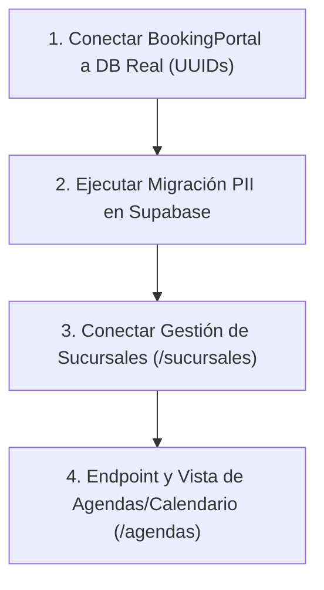

# NEXT_SESSION.md — Estado del Proyecto, Deuda Técnica y Roadmap

> **Propósito:** Guía técnica ejecutiva para retomar el desarrollo en una nueva sesión sin perder contexto ni duplicar esfuerzos.  
> **Modo:** `/ponytail ultra` — Sin relleno, directo al grano, enfocado en código accionable y decisiones de arquitectura.

---

## 📍 1. Dónde nos quedamos (Estado Actual del Código)

- **Auth & Onboarding:**
  - `POST /api/auth/register` utiliza `supabase.auth.signUp()` respaldado por **Resend** (Custom SMTP nativo configurado en Supabase Dashboard).
  - Si la confirmación de correo está activa, el frontend muestra la pantalla estética *"¡Verifica tu Correo Electrónico!"* y detiene la navegación.
  - Se implementó el endpoint PKCE [`/api/auth/callback`](file:///home/sebastian/Escritorio/app/my-app/app/api/auth/callback/route.ts) para procesar el clic del correo y autenticar la sesión hacia `/dashboard`.
  - Se eliminó el error de sintaxis en `app/api/auth/register/route.ts` (línea 148).
- **Seguridad y Control de Tráfico:**
  - **Rate Limiting por IP** ([`lib/security/rate-limit.ts`](file:///home/sebastian/Escritorio/app/my-app/lib/security/rate-limit.ts)): Sliding Window en memoria (5 req / 10 min en registro; 10 req / 5 min en login).
  - **Cloudflare Turnstile** ([`lib/security/turnstile.ts`](file:///home/sebastian/Escritorio/app/my-app/lib/security/turnstile.ts) y [`components/security/TurnstileWidget.tsx`](file:///home/sebastian/Escritorio/app/my-app/components/security/TurnstileWidget.tsx)):
    - **Comportamiento en UI:** El widget de verificación anti-spam está visible en el formulario de registro justo antes del botón de envío.
    - Utiliza claves de prueba oficiales de Cloudflare en desarrollo (`1x0000...`) que pasan en local.
  - **Auth Guard en `proxy.ts`**: Rutas privadas (`/dashboard`, `/sucursales`, `/agendas`) redirigen a `/login` si no hay sesión activa; usuarios con sesión activa son redirigidos a `/dashboard` si entran a `/login` o `/register`.
- **Integridad de Datos:**
  - `/api/auth/me` normalizado con claves `camelCase` y `snake_case`. El Dashboard, Header y Sidebar ya consumen el nombre y slug real del negocio.
  - Webhook de Stripe: Corregido el bug en `customer.subscription.updated` que devolvía `estado: "canceled"`.
  - Citas: Añadida validación cruzada en `crearReservaCita` (sucursal ↔ servicio ↔ profesional).
- **Métricas de Calidad:**
  - `bun x tsc --noEmit`: 0 errores.
  - `bun test`: 44/44 pruebas aprobadas.
  - `bun run lint`: 0 errores / 0 advertencias.
  - `bun run build`: 22 rutas compiladas en Turbopack en ~420ms.

---

## ⚠️ 2. Hallazgos Críticos y Deuda Técnica (No documentados en otros archivos)

### A. UX: Reset del Token de Cloudflare Turnstile tras Error de Registro [RESUELTO ✅]
- **Problema abordado:** Los tokens de Cloudflare Turnstile son de un solo uso (*single-use*). Si el usuario comete un error (ej. contraseña corta o correo ya registrado), la API rechaza la petición y el token queda invalidado en los servidores de Cloudflare.
- **Solución implementada:**
  - En [`app/(auth)/register/page.tsx`](file:///home/sebastian/Escritorio/app/my-app/app/(auth)/register/page.tsx), se implementó `turnstileKey` y reseteo automático en el `catch` de `handleSubmit` (`setTurnstileKey((prev) => prev + 1)` y `setTurnstileToken(null)`).
  - En [`components/security/TurnstileWidget.tsx`](file:///home/sebastian/Escritorio/app/my-app/components/security/TurnstileWidget.tsx), se añadió soporte para la prop `size="normal" | "compact" | "invisible"`.

### B. Visibilidad del Widget de Cloudflare Turnstile
- **Observación actual:** El widget de Cloudflare Turnstile se muestra de forma explícita en pantalla (`managed` mode, visible).
- **Opciones de configuración:**
  1. *Dejarlo visible (actual):* Brinda confianza explícita al usuario de que el sitio está protegido contra bots con el check interactivo de Cloudflare.
  2. *Modo Invisible:* Se puede pasar `size="invisible"` en `<TurnstileWidget size="invisible" ... />` para que no ocupe espacio visual en el formulario y verifique al usuario en segundo plano.

### C. Portal de Reservas de Clientes (`BookingPortal.tsx`) — Desconectado
- **Problema:** [`components/cliente/BookingPortal.tsx`](file:///home/sebastian/Escritorio/app/my-app/components/cliente/BookingPortal.tsx) aún contiene IDs falsos (`"suc-1"`, `"serv-1"`, `"prof-1"`). Al enviar a `/api/cliente/reservas`, PostgreSQL arroja un error de sintaxis UUID (`invalid input syntax for type uuid`).
- **Solución pendiente:** Conectar el componente a `GET /api/cliente/catalogo?slug=${negocioSlug}` y alimentar dinámicamente los selectores con los UUIDs reales de la base de datos.

### D. Migración SQL de Privacidad (PII) Pendiente de Ejecución
- **Archivo creado:** [`supabase/migrations/20260908_pii_security_profesionales.sql`](file:///home/sebastian/Escritorio/app/my-app/supabase/migrations/20260908_pii_security_profesionales.sql).
- **Acción requerida:** El usuario debe correr este script en el SQL Editor de Supabase para revocar el permiso de lectura de `email` y `telefono` de especialistas a los roles públicos `anon` y `authenticated`.

### E. Páginas de Sucursales y Agendas
- [`app/(negocio)/sucursales/page.tsx`](file:///home/sebastian/Escritorio/app/my-app/app/(negocio)/sucursales/page.tsx) y [`app/(negocio)/agendas/page.tsx`](file:///home/sebastian/Escritorio/app/my-app/app/(negocio)/agendas/page.tsx) son maquetas estáticas con arrays en memoria. Falta conectarlas a `GET /api/negocio/sucursales` y crear el endpoint `GET /api/negocio/citas`.

---

## 🎯 3. Roadmap Priorizado para la Siguiente Sesión



### Prioridad 1: Conexión Real de Reservas de Clientes (30 min)
1. Modificar [`components/cliente/BookingPortal.tsx`](file:///home/sebastian/Escritorio/app/my-app/components/cliente/BookingPortal.tsx):
   - Consumir `/api/cliente/catalogo?slug=${negocioSlug}` al montar el componente.
   - Llenar los desplegables con sucursales, servicios y doctores reales.
   - Consumir `/api/cliente/disponibilidad` al seleccionar fecha y sede.
   - Enviar UUIDs válidos a `POST /api/cliente/reservas`.

### Prioridad 2: Panel Administrativo Dinámico (45 min)
1. **Sucursales ([`app/(negocio)/sucursales/page.tsx`](file:///home/sebastian/Escritorio/app/my-app/app/(negocio)/sucursales/page.tsx)):**
   - Conectar a `GET /api/negocio/sucursales`.
   - Implementar modal/formulario para crear nueva sucursal vía `POST /api/negocio/sucursales` respetando el límite del plan activo.
2. **Agendas & Citas ([`app/(negocio)/agendas/page.tsx`](file:///home/sebastian/Escritorio/app/my-app/app/(negocio)/agendas/page.tsx)):**
   - Crear Route Handler `GET /api/negocio/citas` (filtrado por rango de fechas y sucursal).
   - Pintar las citas reales del negocio en la tabla y en la vista de calendario.

---

## 🔑 4. Comandos de Verificación Rápida para el Inicio de Sesión

```bash
# Verificar que no haya errores de tipado
bun x tsc --noEmit

# Ejecutar las 44 pruebas existentes
bun test

# Verificar el linter
bun run lint

# Probar la compilación completa de producción
bun run build

# Iniciar servidor de desarrollo
bun run dev
```

---

*Archivo generado bajo convención Ponytail Ultra para CitaSync MVP.*
