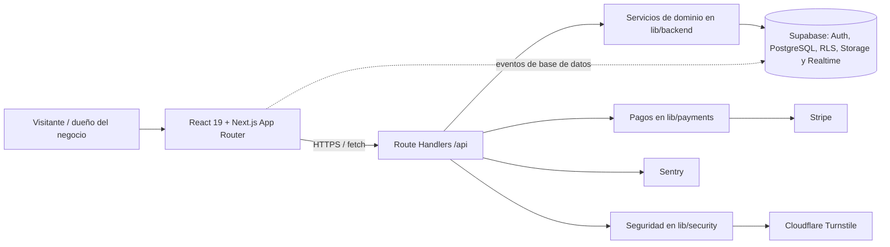

# CitaSync

SaaS multiempresa para que negocios con una o varias sucursales publiquen un portal de reservas, administren sus citas y controlen su suscripción.

> Este README describe el código actual. Se revisaron los archivos de la aplicación, configuración, `lib/`, `components/` y `supabase/`; se excluyeron `AGENTS.md`, `.agents/`, `.codegraph/`, `.gitignore`, `tests/`, `tasks/` y el README anterior, según el alcance solicitado.

## Arquitectura

**Monolito modular full-stack, con arquitectura cliente-servidor y servicios gestionados externos.**

No es una arquitectura de microservicios: el frontend, el backend HTTP y la lógica de dominio se compilan y despliegan como una misma aplicación Next.js. Los módulos están separados por responsabilidad dentro del repositorio, pero no son unidades desplegables independientes. Supabase, Stripe, Cloudflare Turnstile y Sentry son integraciones externas, no microservicios propios.



### Capas y responsabilidades

| Capa | Ubicación | Responsabilidad |
| --- | --- | --- |
| Presentación | `app/`, `components/` | Rutas, layouts, páginas, UI responsive, tema, formularios y notificaciones. |
| API/BFF | `app/api/` | Contrato HTTP interno; autentica, valida entradas y delega al dominio. |
| Dominio | `lib/backend/`, `lib/payments/`, `lib/security/` | Disponibilidad y reserva de citas, límites de plan, sucursales, pagos y controles antiabuso. |
| Acceso a datos | `lib/supabase/`, `supabase/` | Clientes SSR/browser/admin de Supabase, PostgreSQL, Auth, RLS, Storage y migraciones. |
| Estado de cliente | `lib/query/`, `lib/hooks/`, `lib/realtime/` | Caché y mutaciones con React Query; invalidación de citas mediante Supabase Realtime. |
| Observabilidad | `instrumentation.ts`, `sentry.*.config.ts` | Captura de errores en cliente, servidor, Edge y manejadores de API. |

### Flujos principales

- **Autenticación y onboarding:** registro protegido por Turnstile y rate limit, alta en Supabase Auth, creación de negocio/sucursal/suscripción de prueba y callback PKCE para confirmar correo.
- **Reservas públicas:** catálogo, disponibilidad calculada con horarios de sucursal y profesional, validación cruzada de negocio/sucursal/servicio/profesional y creación de cita pendiente de pago.
- **Operación del negocio:** rutas protegidas por `proxy.ts`; la API consulta el negocio de la sesión y aplica límites de suscripción antes de modificar citas, sucursales o configuración.
- **Facturación:** checkout/portal/webhook de Stripe y flujo manual, transferencia o efectivo; la suscripción guarda límites y estado en PostgreSQL.

### Modelo de datos y aislamiento

El esquema PostgreSQL se organiza alrededor de `negocios` como tenant. De él dependen `sucursales`, `servicios`, `profesionales`, horarios, `citas` y una `suscripciones` por negocio. `profesional_servicios` modela la relación muchos-a-muchos. Las políticas RLS restringen la operación del dueño a su tenant y dejan lecturas o inserciones públicas específicamente definidas para el portal. Hay buckets de Storage para logos y avatares; la migración de PII crea una vista pública de profesionales sin email ni teléfono.

## Tecnologías

### Frontend

| Tecnología | Uso actual |
| --- | --- |
| Next.js 16.3.4 + App Router | Rutas, layouts, renderizado React y navegación. |
| React 19.2.8 + TypeScript 5 | Componentes, estado local, contexto y tipado estricto. |
| Tailwind CSS 4 + PostCSS | Estilos utilitarios y tokens en `app/globals.css`. |
| Lucide React | Iconografía. |
| Preline | Componentes/interacciones inicializados en cliente. |
| Sileo | Toasts y mensajes de error humanizados. |
| TanStack React Query 5 | Proveedor, caché, queries y mutaciones reutilizables. |
| Supabase SSR/JS | Sesión del navegador y canales Realtime/presence. |
| Cloudflare Turnstile | Widget anti-spam de registro. |

### Backend

| Tecnología | Uso actual |
| --- | --- |
| Next.js Route Handlers | API interna bajo `app/api/`; actúa como BFF para la UI. |
| Supabase | Auth, PostgreSQL, RLS, Storage y Realtime. |
| PostgreSQL / SQL | Esquema relacional, índices, constraints, triggers `updated_at` y políticas RLS. |
| Stripe SDK | Checkout recurrente, Customer Portal y webhooks firmados. |
| Sentry | Observabilidad y reporte de excepciones. |
| Cloudflare Turnstile API | Verificación server-side de tokens. |
| Upstash Redis REST (opcional) | Backend distribuido para rate limit si se configuran sus credenciales; existe fallback en memoria. |
| Bun 1.3.14 | Gestor de paquetes y ejecución de scripts/pruebas. |

### Servicios e integraciones

- **Resend** se usa indirectamente como SMTP configurado en Supabase Auth para confirmación de correo; no hay SDK de Resend en el repositorio.
- **WhatsApp** tiene una abstracción local (`whatsapp-service.ts`), pero hoy es un stub que escribe en consola: no hay proveedor ni envío real configurado.
- **Supabase Realtime** cuenta con canales para invalidar citas y para presencia/bloqueo visual de slots.

## Patrones de diseño identificados

| Patrón | Evidencia | Propósito |
| --- | --- | --- |
| Monolito modular por capas | `app/api/` → `lib/backend/`/`lib/payments/` → `lib/supabase/` | Separa UI, transporte, dominio y persistencia sin dividir el despliegue. |
| BFF (Backend for Frontend) | Route Handlers en `app/api/` | La UI consume una API propia que oculta credenciales privilegiadas y compone datos de Supabase. |
| Adapter + Factory | `PaymentGatewayAdapter`, `StripeGatewayAdapter`, `ManualGatewayAdapter`, `getPaymentAdapter` | Permite elegir la pasarela sin acoplar las rutas a Stripe o al flujo manual. |
| Service layer | `reserva-service.ts`, `sucursal-service.ts` | Centraliza reglas de disponibilidad, validación de reservas y límites de sucursales. |
| Provider / Context | `ThemeProvider`, `QueryProvider` | Proporciona tema y cliente de caché a los subárboles de React. |
| Custom hooks + cache-aside de cliente | `lib/hooks/`, `apiFetch`, React Query | Encapsula consultas, mutaciones, keys e invalidación de caché. |
| Singleton con inicialización diferida | `getQueryClient`, `getAdminClient`, `getStripeClient` | Reutiliza clientes en navegador/servidor y evita recrearlos innecesariamente. |
| Proxy de acceso a infraestructura | `adminClient` de Supabase | Conserva una interfaz de cliente cómoda y crea el cliente privilegiado solo al necesitarlo. |
| Observer / pub-sub | Canales Supabase Realtime y webhook de Stripe | Reacciona a cambios asíncronos de base de datos y facturación. |
| Cross-cutting error handling | `apiError`, `apiSuccess`, Sentry y `app/error.tsx` | Normaliza respuestas, evita exponer detalles de servidor y reporta fallos. |
| Gatekeeper | `proxy.ts`, `assertActiveSubscription`, rate limiting y Turnstile | Protege rutas, sesión, límites de negocio y puntos de entrada. |

No se identifica un patrón Repository formal: la capa de dominio consulta Supabase directamente a través de sus clientes. Tampoco hay CQRS, microservicios ni una cola de trabajos implementados.

## Estructura

```text
app/
  (landing)/                 landing comercial
  (auth)/                    login y registro
  (cliente)/reserva/[slug]/  portal público de reservas
  (negocio)/                 dashboard, agendas y sucursales
  api/                       BFF: auth, cliente, negocio y webhooks
components/
  cliente/ landing/ negocio/ componentes de cada área
  providers/ security/ theme/ ui/  infraestructura y UI compartida
lib/
  backend/                   reglas de reservas, sucursales y WhatsApp
  payments/                  contratos, adaptadores y planes
  security/                  rate limit y Turnstile
  supabase/                  clientes browser, SSR y service role
  query/ hooks/ realtime/    estado remoto del cliente
  types/ utils/              contratos y utilidades comunes
supabase/
  schema.sql                 esquema PostgreSQL, RLS y Storage
  migrations/                endurecimiento de RLS y PII
```

## Endpoints

| Área | Endpoints | Estado funcional |
| --- | --- | --- |
| Auth | `POST /api/auth/login`, `/register`, `/logout`; `GET /api/auth/me`, `/callback` | Implementados con Supabase Auth, cookies SSR y callback PKCE. |
| Cliente | `GET /api/cliente/catalogo`, `/disponibilidad`; `POST /api/cliente/reservas` | Backend implementado para catálogo, slots y reservas. |
| Negocio | `GET/PATCH /api/negocio/citas`, `GET/POST /sucursales`, `GET/PUT /configuracion` | Implementados con verificación de propietario y plan. |
| Suscripciones | `GET/POST /api/negocio/suscripcion`, `POST /portal`, `POST /api/webhooks/stripe` | Implementados para pago manual y Stripe. |

## Estado actual y límites conocidos

- El **backend de reservas** y los hooks para catálogo/disponibilidad existen, pero `BookingPortal.tsx` todavía presenta arrays e IDs de ejemplo y hace un `fetch` directo. Esos IDs no son UUID válidos para PostgreSQL, por lo que la reserva pública aún no queda conectada de extremo a extremo.
- Las páginas de **Agendas** y **Sucursales** contienen maquetas con datos en memoria; sus endpoints ya existen, pero esas vistas aún no los consumen.
- El dashboard, header y sidebar consumen parte de la API con `fetch` directo; React Query está instalado y preparado para el portal y datos de negocio, pero su adopción visual es parcial.
- La implementación de WhatsApp es un placeholder, no una integración de mensajería real.
- El rate limit en memoria es apropiado para desarrollo o una sola instancia; para despliegue distribuido debe configurarse Upstash Redis.
- La migración `20260908_pii_security_profesionales.sql` debe aplicarse en Supabase para endurecer la exposición de PII descrita en el esquema.

## Configuración local

Requiere Bun 1.3.14 y un proyecto Supabase. Las variables se infieren de los clientes e integraciones del código:

```bash
NEXT_PUBLIC_SUPABASE_URL=
NEXT_PUBLIC_SUPABASE_ANON_KEY=
SUPABASE_SERVICE_ROLE_KEY=

NEXT_PUBLIC_SENTRY_DSN=
SENTRY_DSN=

NEXT_PUBLIC_CLOUDFLARE_TURNSTILE_SITE_KEY=
CLOUDFLARE_TURNSTILE_SECRET_KEY=

STRIPE_SECRET_KEY=
STRIPE_WEBHOOK_SECRET=
STRIPE_PRICE_EMPRENDEDOR_MENSUAL=
STRIPE_PRICE_EMPRENDEDOR_ANUAL=
STRIPE_PRICE_PYME_MENSUAL=
STRIPE_PRICE_PYME_ANUAL=
STRIPE_PRICE_ENTERPRISE_MENSUAL=
STRIPE_PRICE_ENTERPRISE_ANUAL=

# Opcionales: rate limit distribuido
UPSTASH_REDIS_REST_URL=
UPSTASH_REDIS_REST_TOKEN=
```

Después de crear el proyecto de Supabase, aplique `supabase/schema.sql` y las migraciones correspondientes en el orden de su fecha. No exponga `SUPABASE_SERVICE_ROLE_KEY`, `STRIPE_SECRET_KEY`, `STRIPE_WEBHOOK_SECRET` ni tokens de Upstash al navegador.

```bash
bun install
bun run dev
bun run lint
bun test
bun run build
```

## Alcance de calidad

El proyecto usa TypeScript estricto, ESLint 9 con la configuración de Next y pruebas con `bun test`. La aplicación añade cabeceras de seguridad, sanea redirecciones, normaliza errores de API y usa políticas RLS. Estas medidas no sustituyen la ejecución de migraciones ni la configuración de los secretos de producción.


## Recomendaciones para la evolución del producto

Esta sección parte de un objetivo concreto: lanzar en 2–3 meses un MVP para decenas o cientos de negocios, tolerar picos de reservas concurrentes y hacer **imposible** el doble agendamiento desde el punto de vista del producto. El estado de las migraciones y del SQL queda fuera de esta evaluación.

### Decisión arquitectónica recomendada

Adoptar un **monorepo con un monolito modular orientado a dominios**, usando Bun Workspaces y Turborepo. Es una decisión de organización, construcción y límites de código; no es una promesa de permanecer para siempre en una sola aplicación.

La evolución buscada es:

```text
Hoy                         Próximo MVP                      Cuando la evidencia lo exija
-----------------------     -----------------------------    --------------------------------
Una app Next.js        ->   Monorepo + monolito modular  ->  Servicios extraídos mediante
con módulos mezclados       + worker de tareas asíncronas     patrón Strangler

app / componentes / lib     apps/web + paquetes con           worker, notificaciones, reporting
                             dependencias explícitas            o API pública independientes
```

El monolito modular es el punto de partida correcto porque conserva transacciones, despliegue y depuración simples mientras se definen fronteras que después pueden extraerse. Un microservicio debe nacer de una presión observable —carga distinta, despliegue independiente, dependencia especializada o un equipo propietario—, no de una previsión abstracta.

**No recomendaría ahora:** cambiar Next.js, crear un backend NestJS paralelo, GraphQL, Kubernetes, micro-frontends o un bus de eventos como infraestructura central. Todos añaden superficies operativas sin resolver primero la integridad de la reserva ni acelerar el lanzamiento.

### Estructura objetivo del monorepo

La primera versión debe seguir siendo deliberadamente pequeña. Un monorepo con una sola aplicación también es válido: Turborepo puede adoptarse de forma incremental, ejecuta los scripts ya existentes y aporta grafo de tareas y caché compartida cuando el equipo y CI comiencen a repetir trabajo. [Documentación de Turborepo](https://turborepo.dev/docs)

```text
apps/
  web/                         # Única aplicación Next.js desplegable al inicio
  worker/                      # Añadir solo al activar tareas durables de notificación

packages/
  contracts/                   # Esquemas runtime, DTOs, errores públicos y eventos
  domain/                      # Reglas puras: reservas, suscripciones y límites
  ui/                          # Componentes verdaderamente reutilizables y tokens visuales
  config-eslint/               # Configuración compartida y reglas de límites
  config-typescript/           # `tsconfig` base por tipo de paquete

docs/
  adr/                         # Decisiones de arquitectura breves y versionadas
  runbooks/                    # Incidentes operativos, reservas y webhooks
```

No conviene crear `apps/api`, `apps/admin`, un paquete por cada archivo ni una librería interna de utilidades genérica. Deben añadirse solo cuando haya un consumidor o despliegue adicional. Next.js ya puede compilar paquetes locales mediante `transpilePackages`, y Turbopack puede configurarse con la raíz del workspace si hiciera falta; no se requiere una capa de bundling adicional. [Guía de paquetes locales de Next.js](https://nextjs.org/docs/pages/api-reference/config/next-config-js/transpilePackages), [configuración de Turbopack](https://nextjs.org/docs/app/api-reference/config/next-config-js/turbopack).

#### Reglas de dependencia

```text
app/route handler o feature UI
        ↓
application use case
        ↓
domain (sin Next.js, Supabase, Stripe ni UI)
        ↓
ports / interfaces
        ↓
adapters de infraestructura (Supabase, Stripe, Turnstile, mensajería)
```

- `domain` no importa framework ni SDK de terceros; concentra reglas y tipos de negocio verificables.
- Los Route Handlers son adaptadores HTTP delgados: parsean, autorizan, invocan un caso de uso y traducen el resultado HTTP.
- La UI no importa clientes administrativos, lógica de dominio ni modelos de persistencia.
- Cada integración externa queda detrás de un puerto: conservar el patrón actual de pagos y ampliarlo a notificaciones, cache o analítica si se introducen.
- Usar reglas de imports y `turbo boundaries` en CI para impedir dependencias cruzadas; las convenciones sin verificación se degradan rápidamente con seis personas.

### Patrón estándar para el código nuevo

No hace falta imponer Clean Architecture ceremonial en cada botón. Sí hace falta un estándar para los dominios con impacto operativo.

| Necesidad | Estándar recomendado | Aplicación inicial |
| --- | --- | --- |
| Reglas críticas | **Use cases / Application Service** | `CrearReserva`, `ConsultarDisponibilidad`, `CambiarEstadoCita`, `IniciarSuscripción`. |
| Dominio | **Functional core, imperative shell** | Cálculos de horarios, validaciones y transiciones como funciones puras; I/O en adaptadores. |
| Proveedores externos | **Ports and Adapters** | Mantener `PaymentGatewayAdapter`; definir equivalentes para notificaciones y trabajos durables. |
| Errores | **Errores de dominio tipados + un traductor HTTP único** | Sustituir respuestas y `throw` heterogéneos por un catálogo estable: validación, no autorizado, conflicto, límite y proveedor no disponible. |
| Contratos | **Schema-first en runtime** | Esquemas compartidos para entradas, salidas y eventos; TypeScript solo no valida tráfico HTTP. Adoptar Zod como única librería de validación si se necesita una. |
| Lecturas y comandos | **Separación ligera de comandos/queries** | Commands cambian estado e idempotencia; queries devuelven read models. No implementar CQRS con infraestructura separada. |
| Asincronía | **Cola durable + consumidores idempotentes** | Email, WhatsApp, reintentos de proveedor y proyecciones nunca deben vivir dentro de la respuesta de una reserva. |
| UI remota | **Server Components por defecto; React Query para interacción** | Catálogo público cacheable/lecturas en servidor; mutations, filtros y estado interactivo con un único cliente de query. |

Todo nuevo módulo debe incluir: dueño de dominio, contrato de entrada/salida, caso de uso, pruebas de comportamiento, política de errores y una prohibición explícita de importar capas externas. Esto unifica el diseño sin forzar clases, factories o repositorios donde no aportan valor.

### Integridad de reservas y picos concurrentes

La integridad es la prioridad de producto. La interfaz puede mostrar presencia o bloquear visualmente un slot, pero la fuente de verdad debe seguir siendo el flujo de confirmación en servidor.

1. Definir `CrearReserva` como comando idempotente: el cliente envía una clave de idempotencia y reintentar una petición no puede crear dos resultados.
2. Mantener un único punto de decisión de disponibilidad y conflicto; no duplicar la regla entre página, Route Handler y servicio.
3. Tratar un conflicto como resultado esperado de negocio, no como una excepción opaca: devolver al usuario slots alternativos o una instrucción clara para actualizar disponibilidad.
4. Hacer que los efectos secundarios —WhatsApp, email, analítica— se ejecuten después de aceptar la reserva y sean reintentables. Su fallo no debe revertir ni ocultar una cita válida.
5. Antes de abrir a negocios reales, ejecutar una prueba de concurrencia que lance múltiples intentos sobre el mismo slot y demuestre que solo hay una reserva aceptada.

El `worker` se justifica en cuanto existan notificaciones reales, reintentos o tareas de más de unos segundos. Para el plazo del MVP, elegir **un** servicio de funciones/cola durables gestionado o un worker propio con una cola administrada; no construir una cola casera. La elección debe garantizar reintentos acotados, idempotencia, dead-letter/visibilidad de fallos y trazabilidad por `bookingId`.

### Plan de entrega en 2–3 meses

| Etapa | Resultado verificable | Prioridad |
| --- | --- | --- |
| Semanas 1–2 | Decisión de arquitectura en ADR, contrato de módulos, workspace Turborepo mínimo, CI que instala/lint/typecheck/test/build y un entorno de staging. | Bloqueante |
| Semanas 2–4 | Portal público conectado a catálogo y disponibilidad reales; comando de reserva único e idempotente; prueba de concurrencia y flujo de conflicto usable. | Bloqueante |
| Semanas 4–6 | Panel de agendas, sucursales y suscripción consumiendo la API real; estandarización de contratos, errores, validación y React Query. | Alta |
| Semanas 6–8 | Notificaciones con trabajo durable, webhooks observables y reintentables, métricas de negocio, alertas y runbooks. | Alta |
| Semanas 8–12 | Prueba de carga, hardening de despliegue, piloto controlado, corrección por telemetría y expansión gradual. | Alta |

Una refactorización estructural no debe retrasar el flujo crítico. Mover el proyecto a `apps/web` y crear configuración compartida es razonable al inicio; extraer paquetes de dominio debe suceder por cortes verticales, empezando por reservas. El objetivo de cada etapa es una capacidad demostrable, no “terminar la arquitectura”.

### Operación, fiabilidad y observabilidad

Definir objetivos antes de medirlos. Como punto de partida para el MVP:

- tasa de reservas aceptadas y confirmadas, conflictos por slot, latencia p95/p99 de disponibilidad y creación, errores por proveedor, backlog/reintentos de trabajos y resultado de webhooks;
- un identificador de correlación desde la petición hasta la reserva, trabajo asíncrono y notificación;
- logs estructurados y sin PII sensible; Sentry debe recibir contexto de negocio seguro, no correos, teléfonos ni cuerpos completos;
- alertas accionables: caída de reservas, aumento de conflictos, retraso/fallos en jobs, webhooks fallidos y errores 5xx sostenidos;
- runbooks cortos para doble reserva reportada, indisponibilidad de Supabase/Stripe, webhook atrasado y fallo de notificaciones;
- despliegues progresivos, rollback sencillo y feature flags para activar por negocio las funcionalidades de mayor riesgo.

Proponer un SLO inicial de disponibilidad de reserva y API, junto con un presupuesto de error, es más útil que prometer “alta disponibilidad” sin medida. El equipo debe decidir la cifra antes del piloto y revisarla cada mes con datos reales.

### Calidad, pruebas y entrega continua

La suite debe proteger comportamientos de negocio, no solo líneas de código.

| Nivel | Qué debe probar | Herramienta sugerida |
| --- | --- | --- |
| Dominio | Horarios, transiciones de cita, límites, precios y errores. | Bun test; pruebas rápidas y deterministas. |
| Integración | Route Handlers, autenticación, contratos y adaptadores. | Bun test contra un entorno aislado de integración. |
| End-to-end | Registro, confirmación, reserva, conflicto, panel y checkout simulado. | Playwright. |
| Carga | Picos de disponibilidad y el mismo slot solicitado en paralelo. | k6. |
| Seguridad de cadena | Dependencias, secretos y análisis estático. | Dependabot/Renovate, secret scanning, CodeQL o equivalente. |

El pipeline de pull request debe fallar si no pasan formato/lint, tipos, pruebas afectadas, build y pruebas de contrato. El pipeline de despliegue debe promover primero a staging y conservar artefactos, resultados y una ruta de rollback. Turborepo debe configurar correctamente inputs, outputs y variables de entorno antes de habilitar Remote Cache: sus logs son artefactos de caché y no deben contener secretos. [Remote Caching de Turborepo](https://turborepo.dev/docs/core-concepts/remote-caching), [configuración de tareas](https://turborepo.dev/docs/reference/configuration).

### Organización de equipo y gobernanza técnica

Antes de que se integren las seis personas, establecer reglas simples y automatizadas:

- **Ownership:** una persona responsable y un suplente por reservas, facturación, identidad/plataforma y experiencia de negocio; ownership no significa que solo esa persona pueda cambiar el módulo.
- **CODEOWNERS y revisiones:** cambios de contratos, pagos, autenticación e infraestructura requieren revisión de dueño; los demás cambios una revisión mínima.
- **ADRs cortos:** registrar decisiones irreversibles o costosas —monorepo, validación, jobs, despliegue, observabilidad y contratos— con contexto, decisión, consecuencias y fecha de revisión.
- **Definition of Done:** contrato, pruebas apropiadas, métrica/log, manejo de error, accesibilidad básica y documentación operacional cuando cambia un flujo crítico.
- **Convenciones únicas:** nomenclatura, imports, errores, validación, commits y versionado de contratos se automatizan con ESLint, TypeScript, scripts de Turborepo y plantillas de pull request.
- **Ritmo:** PRs pequeños, una decisión por PR, feature flags para cambios incompletos y sesiones semanales de revisión de incidentes/deuda con evidencia.

No crear un “equipo de plataforma” de una persona al inicio. La plataforma debe ser una responsabilidad compartida hasta que la operación genere trabajo suficiente para especializarla.

### Frameworks y herramientas: qué mantener, adoptar y posponer

| Decisión | Recomendación | Motivo |
| --- | --- | --- |
| Next.js + React | **Mantener** | Ya cubre UI, backend HTTP, SSR y despliegue del MVP. Next.js admite organización por feature o ruta; la consistencia importa más que una estructura “canónica”. [Guía oficial](https://nextjs.org/docs/app/getting-started/project-structure) |
| Tailwind + Lucide + Sileo | **Mantener** | No son el cuello de botella; consolidar tokens y componentes antes de sustituir librerías. |
| TanStack React Query | **Mantener y unificar** | Usarlo como estándar de mutations y datos interactivos; eliminar gradualmente `fetch` ad hoc de la UI. |
| Turborepo + Bun Workspaces | **Adoptar ahora, mínimo** | Mejora el ciclo de seis desarrolladores y CI; Remote Cache se activa después de configurar bien las tareas. |
| Zod | **Adoptar para contratos HTTP/eventos** | Unifica validación runtime y tipos compartidos. Evitar coexistencia de varios validadores. |
| Worker/cola durable | **Adoptar al activar mensajería real** | Aísla efectos lentos y reintentos del camino de reserva. |
| Playwright y k6 | **Adoptar antes del piloto** | Protegen los dos riesgos principales: flujo completo y concurrencia. |
| Storybook | **Posponer** | Añadir cuando haya diseño compartido activo o más de una superficie consumiendo `packages/ui`. |
| OpenAPI/SDK público | **Posponer** | El BFF actual es interno; publicarlo antes de tener consumidores externos congela contratos innecesariamente. |
| Micro-frontends/Multi-Zones | **Posponer** | Next.js los reserva para grupos de páginas poco relacionadas con ciclos de liberación propios; no existe esa presión todavía. [Multi-Zones](https://nextjs.org/docs/app/guides/multi-zones) |
| Kubernetes, Kafka, GraphQL, ORM nuevo | **No adoptar para el MVP** | No atacan el riesgo dominante y aumentan la carga operativa. |

Turbopack ya es el bundler predeterminado de Next.js 16; no hay que añadir otra herramienta para lograr compilación incremental. Medir compilaciones y bundles antes de optimizar: Next.js incluye trazas de Turbopack y herramientas de análisis para investigar problemas reales. [Entorno local](https://nextjs.org/docs/app/guides/local-development), [bundling](https://nextjs.org/docs/pages/guides/package-bundling).

### Criterios para extraer servicios sin “tirar” el sistema

Un paquete se convierte en aplicación o servicio independiente solo al cumplir al menos dos de estos criterios:

1. necesita escalar o desplegarse a un ritmo claramente distinto de `web`;
2. procesa tareas largas, reintentos o alto volumen y no debe compartir el ciclo de petición;
3. posee un dominio con contratos estables y un owner de equipo claro;
4. requiere permisos, dependencia tecnológica o política de disponibilidad distinta;
5. sus fallos se deben aislar para no bloquear la creación de una cita.

Probable orden de extracción: **worker de notificaciones** → **reportes/analítica** → **API pública**, si aparecen clientes externos. Pagos y reservas deben permanecer cerca mientras la consistencia y el equipo se beneficien de una operación coordinada. Cada extracción debe conservar el contrato existente, migrar por un feature flag y tener telemetría que pruebe que redujo un problema concreto.

### Primeras decisiones que deben quedar por escrito

1. Aceptar el monorepo Turborepo como estructura de colaboración, no como justificación de múltiples apps.
2. Elegir el estándar de contratos y validación runtime; uno solo.
3. Definir `CrearReserva` como el primer módulo de dominio y la referencia para el resto de patrones.
4. Elegir plataforma de jobs durables antes de conectar WhatsApp/email reales.
5. Acordar SLOs, métricas, alertas, entornos y rollback antes del piloto.
6. Adoptar ADRs, ownership y Definition of Done antes de incorporar al equipo.

La meta no es conseguir una arquitectura “de empresa” antes de vender. Es crear límites que hagan que el MVP sea confiable hoy y extraíble mañana.
