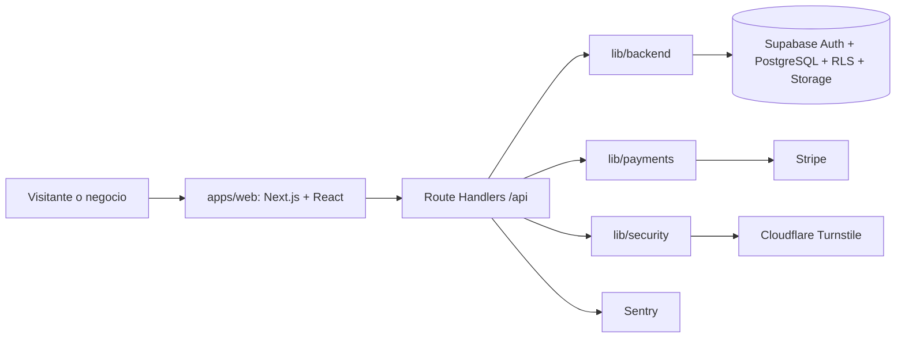

# CitaSync

SaaS multiempresa para que negocios con una o varias sucursales publiquen un portal de reservas, administren sus citas y controlen su suscripción.

## Estado de implementación

| Fase | Estado actual |
| --- | --- |
| Puerta 0 — Monorepo | Completada: Bun Workspaces + Turborepo, con `apps/web` como única aplicación desplegable. |
| Oleada 1 — CI y TanStack Query | Completada: CI con Bun y adopción de hooks en dashboard, header y sidebar. |
| Puerta 1 y siguientes | Pendientes. El alcance y las pausas de revisión están en [PLAN.md](./PLAN.md). |

Este README describe únicamente lo que existe en el repositorio. Las capacidades pendientes se mantienen en el plan y no se presentan aquí como funcionales.

## Arquitectura actual

CitaSync es un monorepo con un monolito modular full-stack. La interfaz, los Route Handlers y la lógica de dominio se compilan y despliegan como una sola aplicación Next.js; Supabase, Stripe, Cloudflare Turnstile y Sentry son servicios gestionados externos.



| Capa | Ubicación | Responsabilidad |
| --- | --- | --- |
| Presentación | `apps/web/app/`, `apps/web/components/` | Rutas, layouts, páginas, formularios, tema y notificaciones. |
| API/BFF | `apps/web/app/api/` | Contrato HTTP interno, autenticación, validación y delegación al dominio. |
| Dominio | `apps/web/lib/backend/`, `apps/web/lib/payments/`, `apps/web/lib/security/` | Reservas, disponibilidad, sucursales, suscripciones, pagos y controles antiabuso. |
| Acceso a datos | `apps/web/lib/supabase/`, `supabase/` | Clientes de Supabase, esquema SQL, RLS, Storage y migraciones. |
| Estado remoto | `apps/web/lib/query/`, `apps/web/lib/hooks/` | Caché, consultas, mutaciones e invalidaciones con TanStack Query. |
| Observabilidad | `apps/web/instrumentation.ts`, `apps/web/sentry.*.config.ts` | Captura de errores en cliente, servidor, Edge y API. |

El tenant principal es `negocios`. De él dependen sucursales, servicios, profesionales, horarios, citas y suscripciones. El SQL versionado incluye constraints, índices y políticas RLS; que una migración exista en el repositorio no confirma que ya se haya aplicado en un proyecto remoto.

## Tecnologías

| Tecnología | Uso actual |
| --- | --- |
| Bun 1.3.14 | Workspaces, instalación, scripts y pruebas. |
| Turborepo 2 | Orquestación de tareas desde la raíz. |
| Next.js 16.3.4 + React 19.2.8 | App Router, UI y Route Handlers. |
| TypeScript 5 + ESLint 9 | Tipado estricto y análisis estático. |
| Tailwind CSS 4 + PostCSS | Estilos y tokens en `apps/web/app/globals.css`. |
| TanStack React Query 5 | Estado remoto, caché y mutaciones. |
| Supabase SSR/JS | Auth, PostgreSQL, RLS, Storage y módulos Realtime. |
| Stripe | Suscripciones del negocio, Customer Portal y webhooks. |
| Cloudflare Turnstile | Protección antiabuso del registro. |
| Sentry | Reporte de excepciones. |
| Lucide, Preline y Sileo | Iconos, interacciones y toasts. |

## Estructura del repositorio

```text
.
├── apps/
│   └── web/
│       ├── app/                 # páginas, layouts y Route Handlers
│       ├── components/          # UI por área y componentes compartidos
│       ├── lib/                 # dominio, pagos, seguridad, hooks y Supabase
│       └── tests/               # pruebas ejecutadas con Bun
├── supabase/
│   ├── schema.sql               # esquema base, RLS y Storage
│   └── migrations/              # cambios SQL versionados
├── .github/workflows/ci.yml     # verificación en push y pull request
├── package.json                 # workspace y scripts raíz
├── turbo.json                   # tareas de Turborepo
└── PLAN.md                      # trabajo futuro y puertas de revisión
```

## Estado funcional

### API

| Área | Endpoints implementados |
| --- | --- |
| Auth | `POST /api/auth/login`, `/register`, `/logout`; `GET /api/auth/me`, `/callback` |
| Cliente | `GET /api/cliente/catalogo`, `/disponibilidad`; `POST /api/cliente/reservas` |
| Negocio | `GET/PATCH /api/negocio/citas`; `GET/POST /sucursales`; `GET/PUT /configuracion` |
| Suscripciones | `GET/POST /api/negocio/suscripcion`; `POST /api/negocio/suscripcion/portal` |
| Webhooks | `POST /api/webhooks/stripe` |

Las rutas privadas autentican la sesión, resuelven el negocio y aplican controles de propietario y, cuando corresponde, de suscripción. El registro actual crea usuario, negocio, sucursal inicial y suscripción de prueba; el onboarding real posterior a la confirmación de correo todavía pertenece a una fase pendiente.

### TanStack Query

La aplicación dispone de `QueryProvider`, un cliente compartido, `apiFetch` y hooks para autenticación, catálogo, disponibilidad, citas, sucursales, suscripción, configuración y creación de reservas.

- Dashboard, header y sidebar consumen datos mediante hooks. `useAuthMe` deduplica `/api/auth/me`.
- La disponibilidad consume `{ horarios }`, conserva los datos 30 segundos y se actualiza al recuperar el foco.
- La mutación de reserva no reintenta automáticamente e invalida la disponibilidad cuando termina correctamente.
- Login, registro y logout conservan `fetch` directo porque son comandos que redirigen o destruyen la sesión.

## Límites conocidos

- El portal público todavía usa sucursales, servicios, profesionales, fecha, email e IDs de demostración y envía la reserva con `fetch` directo. No consume aún el catálogo, la disponibilidad ni `useCrearReserva`, por lo que el flujo no está conectado de extremo a extremo.
- Las páginas de Agendas y Sucursales todavía muestran datos en memoria aunque sus endpoints existen.
- Los módulos de Supabase Realtime y presence existen, pero ninguna UI los consume actualmente.
- WhatsApp es un stub que escribe en consola; no hay proveedor de mensajería conectado.
- Stripe gestiona la suscripción del negocio. El cobro de anticipos de una cita no está implementado de extremo a extremo.
- La validación de disponibilidad previa a crear una cita no garantiza por sí sola exclusión atómica entre peticiones concurrentes. La restricción PostgreSQL contra solapamientos sigue pendiente.
- Las migraciones SQL presentes en `supabase/migrations/` deben revisarse y aplicarse por entorno; este repositorio no demuestra su despliegue remoto.
- Perfiles de usuario, consentimientos y onboarding real siguen pendientes según el plan.

## Configuración local

### Requisitos

- Bun 1.3.14.
- Un proyecto Supabase.
- Credenciales de las integraciones que se quieran activar.

No existe un `.env.example`. Cree `apps/web/.env.local` y configure sólo las variables necesarias:

```bash
NEXT_PUBLIC_SUPABASE_URL=
NEXT_PUBLIC_SUPABASE_ANON_KEY=
SUPABASE_SERVICE_ROLE_KEY=

NEXT_PUBLIC_SENTRY_DSN=
SENTRY_DSN=

NEXT_PUBLIC_CLOUDFLARE_TURNSTILE_SITE_KEY=
CLOUDFLARE_TURNSTILE_SECRET_KEY=

STRIPE_SECRET_KEY=
STRIPE_WEBHOOK_SECRET=
STRIPE_PRICE_EMPRENDEDOR_MENSUAL=
STRIPE_PRICE_EMPRENDEDOR_ANUAL=
STRIPE_PRICE_PYME_MENSUAL=
STRIPE_PRICE_PYME_ANUAL=
STRIPE_PRICE_ENTERPRISE_MENSUAL=
STRIPE_PRICE_ENTERPRISE_ANUAL=

# Opcionales: rate limit distribuido
UPSTASH_REDIS_REST_URL=
UPSTASH_REDIS_REST_TOKEN=
```

No exponga `SUPABASE_SERVICE_ROLE_KEY`, `STRIPE_SECRET_KEY`, `STRIPE_WEBHOOK_SECRET`, `CLOUDFLARE_TURNSTILE_SECRET_KEY` ni el token de Upstash al navegador.

Prepare la base de datos con `supabase/schema.sql` y revise las migraciones de `supabase/migrations/` antes de aplicarlas en orden en cada entorno.

### Comandos

Ejecute desde la raíz:

```bash
bun install
bun run dev
bun run lint
bun run test
bun run build
```

Los scripts raíz delegan en `apps/web` mediante Turborepo. También existe `bun run start` para servir un build de producción.

## Integración continua

`.github/workflows/ci.yml` se ejecuta en pushes a `main` y en pull requests. Instala Bun 1.3.14, usa el lockfile congelado y ejecuta, en orden:

```bash
bun install --frozen-lockfile
bun run lint
bun run test
bun run build
```

El build no se almacena en la caché de Turbo y el pipeline no declara secretos ni archivos `.env` como entradas de caché.

## Calidad y seguridad

El proyecto usa TypeScript estricto, ESLint, pruebas con Bun, cabeceras de seguridad, redirecciones saneadas, errores HTTP normalizados, Turnstile, rate limiting y políticas RLS versionadas. El rate limit usa memoria como fallback y admite Upstash Redis para despliegues distribuidos.

Estas medidas no sustituyen la aplicación controlada de migraciones, la configuración segura de secretos ni las pruebas de concurrencia y extremo a extremo pendientes en [PLAN.md](./PLAN.md).
