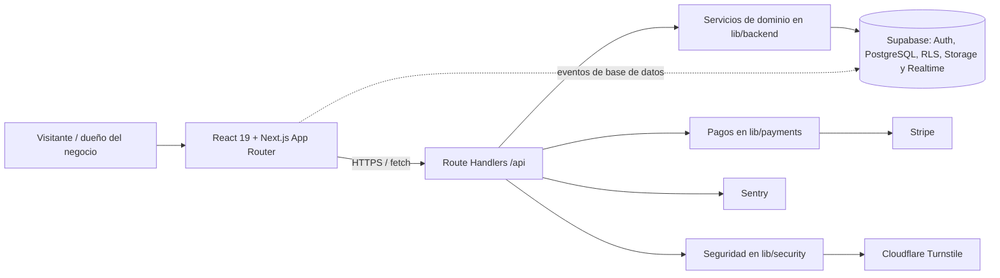

# CitaSync

SaaS multiempresa para que negocios con una o varias sucursales publiquen un portal de reservas, administren sus citas y controlen su suscripción.

> Este README describe el código actual. Se revisaron los archivos de la aplicación, configuración, `lib/`, `components/` y `supabase/`; se excluyeron `AGENTS.md`, `.agents/`, `.codegraph/`, `.gitignore`, `tests/`, `tasks/` y el README anterior, según el alcance solicitado.

## Arquitectura

**Monolito modular full-stack, con arquitectura cliente-servidor y servicios gestionados externos.**

No es una arquitectura de microservicios: el frontend, el backend HTTP y la lógica de dominio se compilan y despliegan como una misma aplicación Next.js. Los módulos están separados por responsabilidad dentro del repositorio, pero no son unidades desplegables independientes. Supabase, Stripe, Cloudflare Turnstile y Sentry son integraciones externas, no microservicios propios.



### Capas y responsabilidades

| Capa | Ubicación | Responsabilidad |
| --- | --- | --- |
| Presentación | `app/`, `components/` | Rutas, layouts, páginas, UI responsive, tema, formularios y notificaciones. |
| API/BFF | `app/api/` | Contrato HTTP interno; autentica, valida entradas y delega al dominio. |
| Dominio | `lib/backend/`, `lib/payments/`, `lib/security/` | Disponibilidad y reserva de citas, límites de plan, sucursales, pagos y controles antiabuso. |
| Acceso a datos | `lib/supabase/`, `supabase/` | Clientes SSR/browser/admin de Supabase, PostgreSQL, Auth, RLS, Storage y migraciones. |
| Estado de cliente | `lib/query/`, `lib/hooks/`, `lib/realtime/` | Caché y mutaciones con React Query; invalidación de citas mediante Supabase Realtime. |
| Observabilidad | `instrumentation.ts`, `sentry.*.config.ts` | Captura de errores en cliente, servidor, Edge y manejadores de API. |

### Flujos principales

- **Autenticación y onboarding:** registro protegido por Turnstile y rate limit, alta en Supabase Auth, creación de negocio/sucursal/suscripción de prueba y callback PKCE para confirmar correo.
- **Reservas públicas:** catálogo, disponibilidad calculada con horarios de sucursal y profesional, validación cruzada de negocio/sucursal/servicio/profesional y creación de cita pendiente de pago.
- **Operación del negocio:** rutas protegidas por `proxy.ts`; la API consulta el negocio de la sesión y aplica límites de suscripción antes de modificar citas, sucursales o configuración.
- **Facturación:** checkout/portal/webhook de Stripe y flujo manual, transferencia o efectivo; la suscripción guarda límites y estado en PostgreSQL.

### Modelo de datos y aislamiento

El esquema PostgreSQL se organiza alrededor de `negocios` como tenant. De él dependen `sucursales`, `servicios`, `profesionales`, horarios, `citas` y una `suscripciones` por negocio. `profesional_servicios` modela la relación muchos-a-muchos. Las políticas RLS restringen la operación del dueño a su tenant y dejan lecturas o inserciones públicas específicamente definidas para el portal. Hay buckets de Storage para logos y avatares; la migración de PII crea una vista pública de profesionales sin email ni teléfono.

## Tecnologías

### Frontend

| Tecnología | Uso actual |
| --- | --- |
| Next.js 16.3.4 + App Router | Rutas, layouts, renderizado React y navegación. |
| React 19.2.8 + TypeScript 5 | Componentes, estado local, contexto y tipado estricto. |
| Tailwind CSS 4 + PostCSS | Estilos utilitarios y tokens en `app/globals.css`. |
| Lucide React | Iconografía. |
| Preline | Componentes/interacciones inicializados en cliente. |
| Sileo | Toasts y mensajes de error humanizados. |
| TanStack React Query 5 | Proveedor, caché, queries y mutaciones reutilizables. |
| Supabase SSR/JS | Sesión del navegador y canales Realtime/presence. |
| Cloudflare Turnstile | Widget anti-spam de registro. |

### Backend

| Tecnología | Uso actual |
| --- | --- |
| Next.js Route Handlers | API interna bajo `app/api/`; actúa como BFF para la UI. |
| Supabase | Auth, PostgreSQL, RLS, Storage y Realtime. |
| PostgreSQL / SQL | Esquema relacional, índices, constraints, triggers `updated_at` y políticas RLS. |
| Stripe SDK | Checkout recurrente, Customer Portal y webhooks firmados. |
| Sentry | Observabilidad y reporte de excepciones. |
| Cloudflare Turnstile API | Verificación server-side de tokens. |
| Upstash Redis REST (opcional) | Backend distribuido para rate limit si se configuran sus credenciales; existe fallback en memoria. |
| Bun 1.3.14 | Gestor de paquetes y ejecución de scripts/pruebas. |

### Servicios e integraciones

- **Resend** se usa indirectamente como SMTP configurado en Supabase Auth para confirmación de correo; no hay SDK de Resend en el repositorio.
- **WhatsApp** tiene una abstracción local (`whatsapp-service.ts`), pero hoy es un stub que escribe en consola: no hay proveedor ni envío real configurado.
- **Supabase Realtime** cuenta con canales para invalidar citas y para presencia/bloqueo visual de slots.

## Patrones de diseño identificados

| Patrón | Evidencia | Propósito |
| --- | --- | --- |
| Monolito modular por capas | `app/api/` → `lib/backend/`/`lib/payments/` → `lib/supabase/` | Separa UI, transporte, dominio y persistencia sin dividir el despliegue. |
| BFF (Backend for Frontend) | Route Handlers en `app/api/` | La UI consume una API propia que oculta credenciales privilegiadas y compone datos de Supabase. |
| Adapter + Factory | `PaymentGatewayAdapter`, `StripeGatewayAdapter`, `ManualGatewayAdapter`, `getPaymentAdapter` | Permite elegir la pasarela sin acoplar las rutas a Stripe o al flujo manual. |
| Service layer | `reserva-service.ts`, `sucursal-service.ts` | Centraliza reglas de disponibilidad, validación de reservas y límites de sucursales. |
| Provider / Context | `ThemeProvider`, `QueryProvider` | Proporciona tema y cliente de caché a los subárboles de React. |
| Custom hooks + cache-aside de cliente | `lib/hooks/`, `apiFetch`, React Query | Encapsula consultas, mutaciones, keys e invalidación de caché. |
| Singleton con inicialización diferida | `getQueryClient`, `getAdminClient`, `getStripeClient` | Reutiliza clientes en navegador/servidor y evita recrearlos innecesariamente. |
| Proxy de acceso a infraestructura | `adminClient` de Supabase | Conserva una interfaz de cliente cómoda y crea el cliente privilegiado solo al necesitarlo. |
| Observer / pub-sub | Canales Supabase Realtime y webhook de Stripe | Reacciona a cambios asíncronos de base de datos y facturación. |
| Cross-cutting error handling | `apiError`, `apiSuccess`, Sentry y `app/error.tsx` | Normaliza respuestas, evita exponer detalles de servidor y reporta fallos. |
| Gatekeeper | `proxy.ts`, `assertActiveSubscription`, rate limiting y Turnstile | Protege rutas, sesión, límites de negocio y puntos de entrada. |

No se identifica un patrón Repository formal: la capa de dominio consulta Supabase directamente a través de sus clientes. Tampoco hay CQRS, microservicios ni una cola de trabajos implementados.

## Estructura

```text
app/
  (landing)/                 landing comercial
  (auth)/                    login y registro
  (cliente)/reserva/[slug]/  portal público de reservas
  (negocio)/                 dashboard, agendas y sucursales
  api/                       BFF: auth, cliente, negocio y webhooks
components/
  cliente/ landing/ negocio/ componentes de cada área
  providers/ security/ theme/ ui/  infraestructura y UI compartida
lib/
  backend/                   reglas de reservas, sucursales y WhatsApp
  payments/                  contratos, adaptadores y planes
  security/                  rate limit y Turnstile
  supabase/                  clientes browser, SSR y service role
  query/ hooks/ realtime/    estado remoto del cliente
  types/ utils/              contratos y utilidades comunes
supabase/
  schema.sql                 esquema PostgreSQL, RLS y Storage
  migrations/                endurecimiento de RLS y PII
```

## Endpoints

| Área | Endpoints | Estado funcional |
| --- | --- | --- |
| Auth | `POST /api/auth/login`, `/register`, `/logout`; `GET /api/auth/me`, `/callback` | Implementados con Supabase Auth, cookies SSR y callback PKCE. |
| Cliente | `GET /api/cliente/catalogo`, `/disponibilidad`; `POST /api/cliente/reservas` | Backend implementado para catálogo, slots y reservas. |
| Negocio | `GET/PATCH /api/negocio/citas`, `GET/POST /sucursales`, `GET/PUT /configuracion` | Implementados con verificación de propietario y plan. |
| Suscripciones | `GET/POST /api/negocio/suscripcion`, `POST /portal`, `POST /api/webhooks/stripe` | Implementados para pago manual y Stripe. |

## Estado actual y límites conocidos

- El **backend de reservas** y los hooks para catálogo/disponibilidad existen, pero `BookingPortal.tsx` todavía presenta arrays e IDs de ejemplo y hace un `fetch` directo. Esos IDs no son UUID válidos para PostgreSQL, por lo que la reserva pública aún no queda conectada de extremo a extremo.
- Las páginas de **Agendas** y **Sucursales** contienen maquetas con datos en memoria; sus endpoints ya existen, pero esas vistas aún no los consumen.
- El dashboard, header y sidebar consumen parte de la API con `fetch` directo; React Query está instalado y preparado para el portal y datos de negocio, pero su adopción visual es parcial.
- La implementación de WhatsApp es un placeholder, no una integración de mensajería real.
- El rate limit en memoria es apropiado para desarrollo o una sola instancia; para despliegue distribuido debe configurarse Upstash Redis.
- La migración `20260908_pii_security_profesionales.sql` debe aplicarse en Supabase para endurecer la exposición de PII descrita en el esquema.

## Configuración local

Requiere Bun 1.3.14 y un proyecto Supabase. Las variables se infieren de los clientes e integraciones del código:

```bash
NEXT_PUBLIC_SUPABASE_URL=
NEXT_PUBLIC_SUPABASE_ANON_KEY=
SUPABASE_SERVICE_ROLE_KEY=

NEXT_PUBLIC_SENTRY_DSN=
SENTRY_DSN=

NEXT_PUBLIC_CLOUDFLARE_TURNSTILE_SITE_KEY=
CLOUDFLARE_TURNSTILE_SECRET_KEY=

STRIPE_SECRET_KEY=
STRIPE_WEBHOOK_SECRET=
STRIPE_PRICE_EMPRENDEDOR_MENSUAL=
STRIPE_PRICE_EMPRENDEDOR_ANUAL=
STRIPE_PRICE_PYME_MENSUAL=
STRIPE_PRICE_PYME_ANUAL=
STRIPE_PRICE_ENTERPRISE_MENSUAL=
STRIPE_PRICE_ENTERPRISE_ANUAL=

# Opcionales: rate limit distribuido
UPSTASH_REDIS_REST_URL=
UPSTASH_REDIS_REST_TOKEN=
```

Después de crear el proyecto de Supabase, aplique `supabase/schema.sql` y las migraciones correspondientes en el orden de su fecha. No exponga `SUPABASE_SERVICE_ROLE_KEY`, `STRIPE_SECRET_KEY`, `STRIPE_WEBHOOK_SECRET` ni tokens de Upstash al navegador.

```bash
bun install
bun run dev
bun run lint
bun test
bun run build
```

## Alcance de calidad

El proyecto usa TypeScript estricto, ESLint 9 con la configuración de Next y pruebas con `bun test`. La aplicación añade cabeceras de seguridad, sanea redirecciones, normaliza errores de API y usa políticas RLS. Estas medidas no sustituyen la ejecución de migraciones ni la configuración de los secretos de producción.
