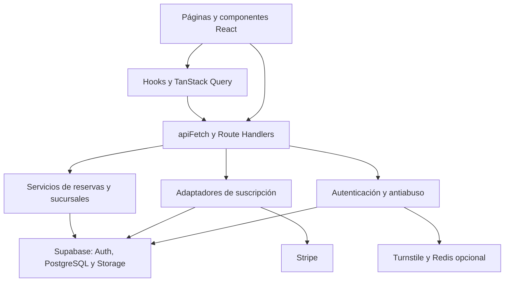

# Agendur

Plataforma SaaS multiempresa para gestionar citas y publicar portales de reservas de negocios con una o varias sucursales. Centraliza catálogo de servicios, profesionales, horarios, datos del negocio y suscripciones.

El repositorio contiene una aplicación **full-stack con Next.js**, organizada como **monolito modular dentro de un monorepo**. Supabase proporciona autenticación y persistencia; Stripe integra la facturación de suscripciones.

> Documentación basada en el código de `main` revisado el **14 de septiembre de 2026**, commit [`504a27e`](https://github.com/LocalHostDiluk/Agendur/tree/504a27efc535a9cab6a6e44ee81b7414386dd1e3). Algunas referencias internas conservan el nombre anterior, **CitaSync**. La presencia de una implementación no acredita que sus servicios externos estén configurados o que el flujo haya sido validado en producción.

## Contenido

- [Funcionalidades y estado actual](#funcionalidades-y-estado-actual)
- [Tecnologías y frameworks](#tecnologías-y-frameworks)
- [Arquitectura](#arquitectura)
- [Patrones de diseño](#patrones-de-diseño)
- [Estructura del proyecto](#estructura-del-proyecto)
- [Modelo de datos](#modelo-de-datos)
- [Flujo de reservas](#flujo-de-reservas)
- [Rutas y API](#rutas-y-api)
- [Instalación y configuración](#instalación-y-configuración)
- [Pruebas y calidad](#pruebas-y-calidad)
- [Seguridad y operación](#seguridad-y-operación)
- [Limitaciones y próximos pasos](#limitaciones-y-próximos-pasos)
- [Contribución y documentación](#contribución-y-documentación)

## Funcionalidades y estado actual

| Área | Implementación presente |
| --- | --- |
| Registro e identidad | Registro con datos del administrador y del negocio, contraseña confirmada, consentimientos versionados y verificación Turnstile. Crea perfil, negocio y prueba de suscripción de 14 días. |
| Sesión | Login, logout, consulta del usuario e intercambio del código de confirmación de correo mediante Supabase Auth. |
| Onboarding | Formulario conectado para actualizar perfil, configurar país y zona horaria del negocio y crear la primera sucursal. El registro inicial ya no crea una sucursal automáticamente. |
| Portal público | `/reserva/[negocioSlug]` consume catálogo, disponibilidad y creación de reservas mediante hooks de TanStack Query. |
| Disponibilidad | Combina horarios de sucursal y profesional, duración del servicio y citas existentes. |
| Reservas | Valida selección, contacto y consentimientos; persiste la cita y maneja conflictos de horario con respuesta `409`. |
| Dashboard | Consulta usuario, citas y suscripción; calcula indicadores y gráficas a partir de las citas recibidas. |
| Configuración | API para datos del negocio, zona horaria y opciones del formulario de reservas. |
| Suscripciones | Adaptadores Stripe y manual; consulta de uso y límites, Checkout, Customer Portal y procesamiento de webhooks. |
| Agendas y sucursales | Sus páginas independientes todavía presentan arreglos de demostración, aunque existen endpoints y hooks relacionados. |
| Realtime | Módulos de cambios de citas y presencia preparados, sin integración actual en las pantallas. |
| WhatsApp | Servicio simulado que escribe en consola; no envía mensajes mediante un proveedor real. |

## Tecnologías y frameworks

Versiones declaradas en los manifiestos del proyecto; `bun.lock` conserva la resolución de dependencias. Los rangos con `^` no representan versiones fijadas exactamente.

| Categoría | Tecnología | Uso |
| --- | --- | --- |
| Runtime y paquetes | Bun `1.3.14` | Instalación, workspaces, scripts y pruebas. |
| Monorepo | Turborepo `^2.7.5` | Orquestación de tareas de `apps/web`. |
| Framework full-stack | Next.js `16.3.4` | App Router, layouts, páginas, Route Handlers y proxy de sesión. |
| Interfaz | React / React DOM `19.2.8` | Componentes, hooks y composición de UI. |
| Lenguaje | TypeScript `^5` | Tipado estricto y alias `@/*` dentro de la aplicación. |
| Estilos | Tailwind CSS `^4`, PostCSS | Utilidades CSS y tokens globales. |
| Estado remoto | TanStack React Query `^5.102.8` | Consultas, mutaciones, caché e invalidación. |
| Backend gestionado | Supabase JS `^2.116.0`, SSR `^0.12.6` | PostgreSQL, Auth, cookies, Storage y módulos Realtime. |
| Pagos | Stripe SDK `^22.6.1` | Suscripciones del negocio y webhooks. |
| Observabilidad | Sentry para Next.js `^10.73.0` | Configuración de captura de errores en cliente, servidor y Edge. |
| UI y animaciones | Base UI, Preline, Motion, Lucide, Sileo, Recharts | Primitivas, interacciones, animación, iconos, notificaciones y gráficas. |
| Utilidades visuales | Blobatar, canvas-confetti, class-variance-authority, tw-animate-css | Avatares, efectos y variantes de estilos. |
| Herramientas de UI | shadcn | Dependencia declarada para herramientas de componentes. |
| Calidad | ESLint `^9`, Bun Test, Playwright `^1.63.0` | Análisis estático, pruebas y escenario de navegador con API interceptada. |
| Protección antiabuso | Cloudflare Turnstile; Upstash Redis opcional | Verificación del registro y almacenamiento distribuido del rate limit. |

## Arquitectura

La aplicación web, su API interna y los servicios de dominio se construyen como una única unidad desplegable: `apps/web`. La separación por módulos permite organizar responsabilidades sin introducir servicios independientes.



| Capa | Ubicación | Responsabilidad |
| --- | --- | --- |
| Presentación | `apps/web/app/`, `apps/web/components/` | Páginas, layouts, formularios y componentes compartidos. |
| Estado remoto | `apps/web/lib/hooks/`, `apps/web/lib/query/` | Acceso HTTP, claves de caché, consultas y mutaciones. |
| API / BFF | `apps/web/app/api/` | Expone contratos HTTP para la interfaz y los visitantes; valida peticiones y sesiones. |
| Dominio | `apps/web/lib/backend/` | Reglas de disponibilidad, creación de citas y sucursales. |
| Facturación | `apps/web/lib/payments/` | Planes, límites, vigencia y adaptadores de pago. |
| Seguridad | `apps/web/lib/security/`, `apps/web/proxy.ts` | Rate limit, Turnstile y renovación/protección de sesión. |
| Persistencia | `apps/web/lib/supabase/`, `supabase/` | Clientes por contexto, esquema relacional, políticas y migraciones. |
| Eventos | `apps/web/lib/realtime/` | Suscripciones a cambios y presencia. |

**Multiempresa:** `negocios` representa al tenant y lo vincula con un propietario mediante `owner_id`. Las consultas privadas comprueban la pertenencia del negocio y el esquema incorpora RLS. El cliente administrativo utiliza `service_role`, por lo que los flujos que lo emplean deben aplicar sus controles de autorización en el servidor.

La separación por capas es práctica: algunos Route Handlers consultan Supabase directamente. No hay una capa Repository independiente ni una separación estricta de Clean Architecture.

## Patrones de diseño

Los siguientes patrones se identifican en implementaciones concretas del repositorio:

| Patrón | Evidencia | Aplicación |
| --- | --- | --- |
| **Adapter** | [`PaymentGatewayAdapter`](apps/web/lib/payments/types.ts), [`StripeGatewayAdapter`](apps/web/lib/payments/stripe-adapter.ts), [`ManualGatewayAdapter`](apps/web/lib/payments/manual-adapter.ts) | Define un contrato común para integrar Stripe y pagos manuales. Las capacidades de portal y webhook son opcionales. |
| **Factory simple** | [`getPaymentAdapter()`](apps/web/lib/payments/index.ts) | Selecciona el adaptador según la pasarela: Stripe, manual, transferencia o efectivo. |
| **Strategy** | `getPaymentAdapter()` y el contrato de pagos | Permite variar el comportamiento de Checkout según el medio elegido, manteniendo una interfaz común para el consumidor. |
| **Singleton por contexto** | [`getAdminClient()`](apps/web/lib/supabase/admin.ts), [`getQueryClient()`](apps/web/lib/query/client.ts) | Reutiliza el cliente administrativo por proceso y el QueryClient en el navegador. En servidor se crea un QueryClient nuevo para evitar compartir caché entre solicitudes. |
| **Proxy con inicialización diferida** | `adminClient` en [`admin.ts`](apps/web/lib/supabase/admin.ts) | Un `Proxy` de JavaScript crea el cliente privilegiado al primer acceso y enlaza sus métodos a la instancia real. Es distinto del proxy HTTP de Next.js. |
| **Observer / publicación-suscripción** | [`citas-channel.ts`](apps/web/lib/realtime/citas-channel.ts), [`layout del negocio`](apps/web/app/(negocio)/layout.tsx) | El canal escucha cambios y puede invalidar consultas; el estado del sidebar notifica a sus suscriptores mediante `useSyncExternalStore`. |
| **Provider y composición** | [`QueryProvider`](apps/web/components/providers/QueryProvider.tsx), [`ThemeProvider`](apps/web/components/theme/ThemeProvider.tsx) | Comparte dependencias y estado transversal con el árbol de componentes. |
| **Service Layer** | [`reserva-service.ts`](apps/web/lib/backend/reserva-service.ts), [`sucursal-service.ts`](apps/web/lib/backend/sucursal-service.ts) | Agrupa reglas de negocio que los endpoints pueden reutilizar. |
| **Fachada HTTP y errores tipados** | [`apiFetch`](apps/web/lib/query/api-client.ts), [`api-error.ts`](apps/web/lib/utils/api-error.ts) | Simplifica el consumo de respuestas y concentra tratamiento de errores; algunos endpoints mantienen respuestas específicas. |

También se usan **guardas de negocio**, como `assertActiveSubscription()`, y **hooks personalizados** para separar consultas de la representación visual. La creación del registro incluye compensación ante fallos de aprovisionamiento mediante eliminación del usuario recién creado; no constituye una transacción única entre Auth y todas las escrituras.

## Estructura del proyecto

| Ruta | Contenido |
| --- | --- |
| `apps/web/app/(landing)/` | Landing y borradores de términos y privacidad. |
| `apps/web/app/(auth)/` | Login y registro. |
| `apps/web/app/(negocio)/` | Dashboard, onboarding, agendas y sucursales. |
| `apps/web/app/(cliente)/` | Portal público de reservas por slug. |
| `apps/web/app/api/` | Endpoints de autenticación, negocio, cliente y webhooks. |
| `apps/web/components/` | Componentes por área, UI, providers, tema y seguridad. |
| `apps/web/lib/` | Dominio, pagos, Supabase, hooks, consultas, tipos y utilidades. |
| `apps/web/tests/` | Pruebas con Bun. |
| `apps/web/e2e/` | Escenario Playwright. |
| `apps/web/proxy.ts` | Renovación de sesión y redirecciones de acceso. |
| `supabase/schema.sql` | Snapshot SQL para una base nueva. |
| `supabase/migrations/` | Cambios históricos del esquema. |
| `.github/workflows/ci.yml` | Pipeline de verificación. |
| `package.json`, `turbo.json`, `bun.lock` | Workspaces, tareas y resolución de dependencias. |

Los grupos de rutas entre paréntesis organizan el código y no forman parte de la URL.

## Modelo de datos

El esquema define **11 tablas de aplicación** en `public`:

| Tabla | Función y relaciones principales |
| --- | --- |
| `negocios` | Tenant, propietario, marca, país, zona horaria y configuración de reservas. |
| `perfiles_usuario` | Nombres, apellidos, teléfono y locale asociados a `auth.users`. |
| `consentimientos_usuario` | Documento, versión y aceptación asociados al usuario. |
| `sucursales` | Ubicaciones pertenecientes a un negocio. |
| `servicios` | Catálogo del negocio con precio y duración. |
| `profesionales` | Personal asociado a sucursales. |
| `profesional_servicios` | Relación muchos a muchos entre profesionales y servicios. |
| `horarios_sucursal` | Horarios semanales de apertura. |
| `horarios_profesional` | Horarios semanales del profesional. |
| `citas` | Reserva, relaciones de negocio, contacto, precio, estado y consentimientos. |
| `suscripciones` | Plan, pasarela, periodo, estado y límites del negocio. |

La vista `profesionales_publicos` expone campos del catálogo sin email ni teléfono y utiliza `security_invoker`. El snapshot también define los buckets públicos `logos-negocios` y `avatars-profesionales`, junto con políticas de Storage.

Las citas pueden estar en `pendiente_pago`, `confirmada`, `completada`, `cancelada` o `no_asistio`. La restricción `citas_profesional_horario_excl` usa GiST y `btree_gist` para impedir intervalos solapados del mismo profesional cuando el estado es `pendiente_pago` o `confirmada`. Los intervalos son semiabiertos `[inicio, fin)`, permitiendo citas consecutivas.

## Flujo de reservas

1. El visitante abre `/reserva/[negocioSlug]`; `useCatalogo` obtiene negocio, sucursales, servicios y profesionales.
2. Selecciona sucursal, servicio, profesional y fecha; `useDisponibilidad` consulta los horarios.
3. Introduce su contacto y acepta privacidad y, cuando corresponde, la política de cancelación.
4. `useCrearReserva` envía el formulario. El servidor comprueba selección, configuración, suscripción y disponibilidad antes de insertar.
5. La base impide solapamientos concurrentes. El error PostgreSQL `23P01` se traduce a HTTP `409` con código `SLOT_UNAVAILABLE`.
6. Ante conflicto, la interfaz limpia el horario elegido y vuelve a consultar disponibilidad. Tras éxito, muestra la reserva e invalida la caché correspondiente.

La consulta de disponibilidad tiene `staleTime` de 30 segundos y se actualiza al recuperar el foco. La mutación de reserva no reintenta automáticamente. Las utilidades de fechas contemplan la zona horaria del negocio o sucursal.

**Estado inicial actual:** el servicio inserta la cita como `pendiente_pago` y con anticipo pagado en cero. Esto no significa que el cobro del anticipo esté implementado.

## Rutas y API

Páginas principales: `/`, `/login`, `/register`, `/onboarding`, `/dashboard`, `/agendas`, `/sucursales`, `/reserva/[negocioSlug]`, `/terminos` y `/privacidad`.

| Método | Endpoint | Propósito |
| --- | --- | --- |
| POST | `/api/auth/register` | Registro, perfil, consentimientos, negocio y trial. |
| POST | `/api/auth/login` | Iniciar sesión. |
| POST | `/api/auth/logout` | Cerrar sesión. |
| GET | `/api/auth/me` | Usuario, perfil, negocio y estado del onboarding. |
| GET | `/api/auth/callback` | Intercambiar el código de confirmación por una sesión. |
| PUT | `/api/auth/profile` | Actualizar el perfil del usuario autenticado. |
| GET | `/api/cliente/catalogo?slug=...` | Catálogo público del negocio. |
| GET | `/api/cliente/disponibilidad` | Horarios por `sucursalId`, `servicioId`, `fecha` y `profesionalId` opcional. |
| POST | `/api/cliente/reservas` | Crear una reserva pública. |
| GET / PATCH | `/api/negocio/citas` | Consultar y actualizar citas del negocio. |
| GET / POST | `/api/negocio/sucursales` | Consultar y crear sucursales. |
| GET / PUT | `/api/negocio/configuracion` | Consultar y actualizar configuración. |
| GET / POST | `/api/negocio/suscripcion` | Consultar suscripción o iniciar el flujo de contratación. |
| POST | `/api/negocio/suscripcion/portal` | Crear sesión del Customer Portal de Stripe. |
| POST | `/api/webhooks/stripe` | Recibir eventos firmados de Stripe. |

Las operaciones privadas verifican la sesión y la pertenencia del recurso; las guardas de suscripción se aplican donde corresponde. El portal de reservas es público y no requiere una cuenta del cliente.

## Instalación y configuración

### Requisitos

- Git y Bun **1.3.14**, versión declarada en `packageManager` y en CI.
- Un proyecto Supabase con el esquema preparado y autenticación por correo configurada.
- Credenciales de las integraciones que se vayan a utilizar.

### 1. Instalar dependencias

```bash
git clone https://github.com/LocalHostDiluk/Agendur.git
cd Agendur
bun install --frozen-lockfile
```

### 2. Preparar la base de datos

Consulta primero [`supabase/README.md`](supabase/README.md).

- **Base nueva:** ejecuta `supabase/schema.sql` una sola vez desde el SQL Editor de Supabase. Es un snapshot consolidado que ya incorpora las migraciones históricas.
- **Base existente:** identifica su estado y aplica únicamente los cambios que le falten. No ejecutes el snapshot como una actualización general.
- **No ejecutes todas las migraciones históricas encima del snapshot:** pueden recrear tablas, columnas, políticas y restricciones ya presentes.
- El README de Supabase registra que el entorno de desarrollo se gestionó mediante SQL Editor y sin historial `supabase_migrations.schema_migrations`. Antes de adoptar un flujo con CLI debe reconciliarse ese historial.

La información sobre la base remota procede de la auditoría documentada en el repositorio; debe comprobarse para cada entorno.

### 3. Configurar variables de entorno

Crea `apps/web/.env.local`. Actualmente no se incluye `.env.example`.

```dotenv
# Supabase: necesarias para los flujos de autenticación y datos
NEXT_PUBLIC_SUPABASE_URL=https://TU_PROYECTO.supabase.co
NEXT_PUBLIC_SUPABASE_ANON_KEY=REEMPLAZAR
SUPABASE_SERVICE_ROLE_KEY=REEMPLAZAR

# Registro: URLs HTTPS y versiones de los documentos aceptados
NEXT_PUBLIC_TERMS_URL=https://TU_DOMINIO/terminos
NEXT_PUBLIC_PRIVACY_URL=https://TU_DOMINIO/privacidad
NEXT_PUBLIC_TERMS_VERSION=REEMPLAZAR
NEXT_PUBLIC_PRIVACY_VERSION=REEMPLAZAR

# Turnstile: configurar claves reales para producción
NEXT_PUBLIC_CLOUDFLARE_TURNSTILE_SITE_KEY=
CLOUDFLARE_TURNSTILE_SECRET_KEY=

# Suscripciones Stripe
STRIPE_SECRET_KEY=
STRIPE_WEBHOOK_SECRET=
STRIPE_PRICE_EMPRENDEDOR_MENSUAL=
STRIPE_PRICE_EMPRENDEDOR_ANUAL=
STRIPE_PRICE_PYME_MENSUAL=
STRIPE_PRICE_PYME_ANUAL=
STRIPE_PRICE_ENTERPRISE_MENSUAL=
STRIPE_PRICE_ENTERPRISE_ANUAL=

# Observabilidad opcional
NEXT_PUBLIC_SENTRY_DSN=
SENTRY_DSN=

# Rate limit distribuido opcional
UPSTASH_REDIS_REST_URL=
UPSTASH_REDIS_REST_TOKEN=
```

Los valores `REEMPLAZAR` y `TU_DOMINIO` son marcadores. El registro devuelve `503` si faltan URLs legales HTTPS válidas o sus versiones; devuelve `409` si las versiones enviadas por el formulario ya no coinciden con las configuradas. `/terminos` y `/privacidad` contienen borradores, por lo que su contenido debe completarse antes de abrir el registro públicamente.

El código usa claves de prueba de Turnstile cuando no se configuran las variables; ese fallback no está restringido exclusivamente a desarrollo. En producción configura ambos valores reales.

En Supabase Auth configura la URL del sitio y permite el callback `/api/auth/callback` para cada origen utilizado. La confirmación de correo depende de la configuración de Auth y de su servicio de correo/SMTP; no hay un SDK de Resend integrado en la aplicación.

### 4. Iniciar la aplicación

```bash
bun run dev
```

Abre [http://localhost:3000](http://localhost:3000). Los scripts raíz delegan en el workspace `web` mediante Turborepo.

| Comando desde la raíz | Acción |
| --- | --- |
| `bun run dev` | Servidor de desarrollo Next.js. |
| `bun run lint` | Análisis ESLint. |
| `bun run test` | Pruebas Bun. |
| `bun run build` | Build de producción. |
| `bun run start` | Servir un build generado previamente. |

Para producción, configura las variables en el entorno de ejecución y las variables públicas antes del build; ejecuta `bun run build` y después `bun run start`. El proyecto requiere un entorno capaz de ejecutar Next.js con Route Handlers, no únicamente alojamiento de archivos estáticos.

### 5. Preparar un negocio para recibir reservas

Registra y confirma la cuenta cuando Auth lo requiera, completa el onboarding y crea la primera sucursal. Asegúrate de que existan servicios activos, profesionales activos, relaciones `profesional_servicios` y horarios de apertura. La suscripción debe estar vigente. Las pantallas actuales no ofrecen un CRUD completo para todos esos datos.

### Integración Stripe

Configura los identificadores de precios de los planes y el endpoint `/api/webhooks/stripe` con su secreto de firma. El adaptador procesa `checkout.session.completed`, `customer.subscription.updated`, `customer.subscription.deleted` e `invoice.payment_failed`.

El pago manual registra una solicitud en estado `paused`; la activación exige confirmación administrativa mediante la lógica interna correspondiente. No existe un endpoint público para ejecutar `activarPlanManual()`.

## Pruebas y calidad

La suite de `apps/web/tests/` cubre autenticación, identidad y onboarding, reservas, disponibilidad, fechas del negocio, pagos, seguridad, hooks, infraestructura de consultas, Realtime y componentes. Varias pruebas utilizan mocks o inspección de código: no equivalen a validar servicios externos reales.

Existe un escenario en `apps/web/e2e/booking.pw.ts` que recorre registro, onboarding y reserva después de un conflicto. **Intercepta todas las API**, por lo que no comprueba concurrencia real contra PostgreSQL ni la entrega de correos o mensajes.

Para ejecutarlo, con las dependencias instaladas:

```bash
cd apps/web
bunx playwright test
```

La configuración usa Google Chrome (`channel: "chrome"`) y arranca un servidor en `http://127.0.0.1:3107`; ese navegador debe estar disponible y el puerto libre. No hay un script `test:e2e` declarado.

### Integración continua

[`ci.yml`](.github/workflows/ci.yml) se ejecuta en pushes a `main` y en pull requests:

```bash
bun install --frozen-lockfile
bun run lint
bun run test
bun run build
```

El pipeline fija Bun 1.3.14. Playwright no forma parte de esas etapas. Turborepo tiene desactivada la caché de build.

## Seguridad y operación

- Clientes Supabase separados para navegador, servidor con cookies y operaciones administrativas. Las claves `service_role`, Stripe, Turnstile y el token de Redis deben permanecer en servidor.
- Comprobación de sesión en endpoints privados, autorización por negocio y RLS en las 11 tablas del snapshot.
- `proxy.ts` renueva la sesión y protege por redirección `/dashboard`, `/agendas` y `/sucursales`. El onboarding comprueba sesión en su interfaz y sus endpoints; no está incluido en esa lista de redirección del proxy.
- Cookies de sesión configuradas como `HttpOnly`, `SameSite=Lax` y `Secure` en producción; saneamiento de destinos de redirección.
- Rate limit en login, registro y creación de reservas. Sin Upstash se utiliza memoria local del proceso, que no comparte contadores entre instancias.
- Cabeceras `X-Frame-Options`, `X-Content-Type-Options`, `Referrer-Policy` y HSTS definidas en `next.config.ts`.
- Catálogo con proyección explícita de campos públicos; restricciones de lectura de datos personales de profesionales en el SQL actualizado.
- Errores y excepciones integrados con Sentry; restricciones de base de datos para contacto, intervalos válidos y solapamientos.

Consulta [`supabase/README.md`](supabase/README.md) para los resultados, correcciones y consultas reproducibles de la auditoría de datos. La configuración efectiva del entorno debe corresponder al esquema versionado.

## Limitaciones y próximos pasos

- Conectar las páginas independientes de Agendas y Sucursales a los hooks y endpoints existentes.
- Completar la administración de servicios, profesionales y horarios para preparar el catálogo desde la UI.
- Integrar los canales Realtime y de presencia en las pantallas.
- Sustituir el stub de WhatsApp por un proveedor real y definir su operación.
- Completar el cobro de anticipos de citas; Stripe actualmente cubre suscripciones del negocio.
- Validar dos reservas HTTP simultáneas contra una base controlada: la exclusión SQL y el manejo de `409` están implementados, pero la auditoría del repositorio deja pendiente esa prueba real.
- Completar los documentos legales y su configuración de versiones.
- Añadir `.env.example` y un flujo reproducible de preparación de datos y migraciones por entorno.

## Contribución y documentación

Para proponer cambios, trabaja en una rama, conserva `bun.lock` y ejecuta lint, pruebas y build antes de abrir un pull request. Los cambios de dominio deben mantener los controles de pertenencia al negocio y las restricciones del esquema. Actualiza este README cuando cambien rutas, variables, arquitectura o estado funcional.

Documentación complementaria:

- [Esquema, migraciones y auditoría Supabase](supabase/README.md).
- [Snapshot SQL](supabase/schema.sql).
- [Sistema de diseño](Design-system.md).
- [Guía de estilos](estilos.md).
- [Manifiesto de la aplicación](apps/web/package.json).

**Licencia:** el repositorio revisado no contiene un archivo `LICENSE`. No se declara una licencia de distribución en este README.
