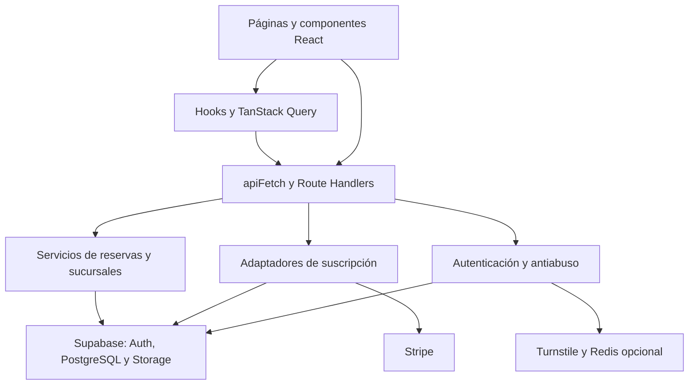

# Agendur

Plataforma SaaS multiempresa para gestionar citas y publicar portales de reservas de negocios con una o varias sucursales. Centraliza catálogo de servicios, profesionales, horarios, datos del negocio y suscripciones.

El repositorio contiene una aplicación **full-stack con Next.js**, organizada como **monolito modular dentro de un monorepo**. Supabase proporciona autenticación y persistencia; Stripe integra la facturación de suscripciones.

El esquema vigente, los contratos de horarios/reservas, la matriz de roles y el procedimiento de operación remota están en [Backend y Supabase remoto](docs/BACKEND_SUPABASE.md), documento canónico del backend.

## Mejoras prioritarias del sistema

Auditoría histórica del frontend, backend y proyecto Supabase activo `Citas`. Las tablas de esta sección conservan hallazgos y criterios originales, no una lista de fallos actuales: contrastar los puntos de backend con el documento canónico y los [planes históricos](docs/planes/).

**Estado backend al 1 de octubre de 2026:** 25 migraciones remotas verificadas, 16 tablas `public` con RLS, sin grants de tabla/columna para `anon`; RPC privilegiadas sólo servidor. Horarios semanales, herencia profesional, excepciones, reservas con snapshots/buffer y prueba HTTP concurrente contra PostgreSQL están implementados y verificados. Storage conserva lectura pública intencional de imágenes. Pendientes: protección de contraseñas filtradas en Dashboard y validación integral con Stripe real; ver evidencia y límites en el documento canónico.

Prioridades:

- **P0 — Bloqueo:** riesgo de seguridad, datos o producción que debe resolverse antes del lanzamiento.
- **P1 — Requerido:** flujo existente roto, engañoso o CRUD incompleto.
- **P2 — Mejora:** deuda comprobada de calidad, coherencia o mantenimiento.

Cada bloque tiene un único responsable principal. **Tú** coordinas Datos y seguridad; los otros cuatro responsables pueden sustituirse por los nombres del equipo al asignar el trabajo.

### 1. Responsable Datos y seguridad

| ID | Prioridad | Hallazgo y evidencia | Acción | Criterio de aceptación | Dependencias |
| --- | --- | --- | --- | --- | --- |
| DS-01 | P0 | El proyecto Supabase activo no registra historial de migraciones y no contiene `stripe_webhook_events` ni los hardenings locales recientes. | Reconciliar el esquema remoto con las migraciones versionadas y establecer una línea base reproducible antes de aplicar nuevos cambios. | Un entorno limpio puede reproducir el esquema; local y remoto muestran las mismas migraciones, tablas, índices y políticas esperadas. | Bloquea BE-01 y BE-02. |
| DS-02 | P0 | `citas` permite `INSERT` directo a `anon` y `authenticated`, lo que evita validaciones de disponibilidad, consentimiento y rate limiting del endpoint de reservas. | Aplicar la revocación versionada y comprobar que la creación pública sólo sea posible mediante el backend. | Un `INSERT` anónimo por Data API es rechazado, mientras `/api/cliente/reservas` sigue creando citas válidas. | DS-01. |
| DS-03 | P0 | Varias tablas consumidas mediante las APIs del servidor conservan grants y políticas públicas más amplios que la proyección ofrecida por esos endpoints. | Inventariar los consumidores reales y revocar acceso directo innecesario de `anon` y `authenticated`, manteniendo privilegio mínimo. | Catálogo y disponibilidad públicos funcionan por API; la Data API no expone columnas internas ni permite operaciones fuera del contrato. | DS-01; coordinar con BE-05. |
| DS-04 | P0 | `public.rls_auto_enable` es `SECURITY DEFINER` ejecutable por roles públicos; `handle_updated_at` no fija `search_path`; la protección de contraseñas filtradas está desactivada. | Mover o retirar la función privilegiada, revocar `EXECUTE`, fijar `search_path` y activar la protección de contraseñas. | Los advisors de Supabase no reportan estas alertas y ninguna función privilegiada queda invocable por `anon` o `authenticated`. | DS-01. |
| DS-05 | P1 | Advisors detectan políticas que evalúan `auth.uid()` por fila, políticas permisivas superpuestas e índices faltantes en `citas(servicio_id)` y `profesional_servicios(servicio_id)`. | Usar `(select auth.uid())`, consolidar políticas por operación y aplicar los índices versionados; conservar índices de integridad aunque el uso actual sea bajo. | Advisors sin estas advertencias, aislamiento multiempresa comprobado y planes de consulta usando los índices apropiados. | DS-01 y DS-03. |
| DS-06 | P1 | La interfaz intenta guardar notas internas en una cita, pero el modelo sólo dispone de `notas_cliente`; el formulario de personal captura un cargo que tampoco se persiste. | Preparar migraciones para `citas.notas_internas` y `profesionales.cargo` si el campo permanece en el formulario. | Las notas internas nunca se mezclan con las del cliente ni aparecen en APIs públicas; el cargo sobrevive una recarga. | Resuelto (migración y tipos creados). |

**Aceptación del bloque:** migraciones reproducibles, advisors sin alertas críticas, acceso anónimo directo denegado y endpoints públicos de catálogo y reserva operativos.

### 2. Responsable Backend y pagos

| ID | Prioridad | Hallazgo y evidencia | Acción | Criterio de aceptación | Dependencias |
| --- | --- | --- | --- | --- | --- |
| BE-01 | P0 | Un webhook de Stripe verificado falla porque la tabla de idempotencia no existe en el proyecto activo; si falta `STRIPE_WEBHOOK_SECRET`, el handler responde `200` y descarta eventos. | Hacer obligatoria la configuración en producción y devolver error recuperable cuando no pueda verificarse o persistirse un evento. | Producción no arranca o el webhook devuelve estado no exitoso sin secreto; un evento válido se registra y aplica una sola vez. | DS-01. |
| BE-02 | P0 | El flujo comprueba existencia, aplica el efecto y después inserta el evento; entregas simultáneas pueden ejecutar el efecto dos veces antes de colisionar por la clave primaria. | Reclamar atómicamente el identificador antes del efecto y permitir reintentos seguros cuando el procesamiento falle. | Dos solicitudes concurrentes con el mismo `event.id` producen un solo cambio; un fallo previo a completar puede reintentarse. | DS-01 y BE-01. |
| BE-03 | P1 | El drawer envía sólo `notas`, pero `PATCH /api/negocio/citas` exige `nuevoEstado` e ignora ese campo, por lo que el guardado falla. | Aceptar estado, `notasInternas` o ambos, exigir al menos un cambio y mantener la autorización por propietario del negocio. | Guardar notas y cambiar estado funcionan juntos o por separado; entradas vacías o citas ajenas son rechazadas. | DS-06; desbloquea FE-02. |
| BE-04 | P1 | La creación manual elige el primer profesional elegible y conserva fallbacks que pueden terminar en un identificador de negocio o UUID nulo, sin validar disponibilidad final. | Requerir un profesional válido, comprobar servicio, sucursal, horario y solapamiento en el servidor y eliminar fallbacks inválidos. | No puede crearse una cita manual con profesional inexistente, incompatible u ocupado; la respuesta explica el conflicto. | OP-01 y OP-02. |
| BE-05 | P1 | El rate limiter confía en cabeceras de IP sin una política de proxy explícita; el contador remoto no es atómico y catálogo/disponibilidad carecen de límites. | Definir la cabecera confiable del despliegue, usar una operación atómica compartida y aplicar límites proporcionados a endpoints públicos de lectura. | Una IP no puede falsificar su identidad mediante cabeceras libres; varias instancias comparten el conteo y los endpoints responden `429` de forma consistente. | Coordinar DS-03. |
| BE-06 | P2 | `getSucursalesByNegocio` no tiene consumidores de producción y el adaptador de WhatsApp sólo simula el envío. | Eliminar exports muertos y documentar WhatsApp como integración no productiva hasta contar con proveedor y credenciales reales. | No quedan exports sin uso ni documentación que afirme entregas reales de WhatsApp. | QA-06. |

### 3. Responsable CRUD operativo

| ID | Prioridad | Hallazgo y evidencia | Acción | Criterio de aceptación | Dependencias |
| --- | --- | --- | --- | --- | --- |
| OP-01 | P1 | El alta de personal genera un ID local aleatorio y guarda datos sólo en estado React; desaparecen al recargar y no existe API de profesionales. | Implementar `GET/POST/PATCH /api/negocio/profesionales` y persistir perfil, cargo, servicios asignados y estado `activo`. | Crear, editar y desactivar personal sobrevive una recarga y sólo afecta al negocio autenticado. | Resuelto (API, hooks, UI y persistencia completados). |
| OP-02 | P1 | La matriz de horarios muestra valores fijos y no administra `horarios_profesional` ni `horarios_sucursal`. | Reutilizar las tablas existentes y añadir edición desde las pantallas actuales, sin crear un segundo modelo de horarios. | Los horarios editados reaparecen tras recargar y modifican correctamente la disponibilidad pública. | OP-01 para horarios personales; coordinar BE-04. |
| OP-03 | P1 | Sucursales sólo dispone de `GET/POST`; no puede editarse ni desactivarse una existente. | Añadir `PATCH` y archivo lógico mediante `activo`, incluyendo sus horarios cuando corresponda; evitar borrado físico. | Datos, horarios y estado se actualizan de forma persistente; una sucursal inactiva deja de ofrecer reservas sin perder historial. | OP-02. |
| OP-04 | P1 | Servicios permite crear y alternar `activo`, pero la UI no expone edición de los campos ya soportados por la API. | Completar el formulario de edición y conservar `activo` como mecanismo de archivo lógico. | Nombre, duración, precio, color y estado se actualizan tras recargar; citas históricas mantienen su referencia. | Sin dependencia de esquema. |

**Criterio del bloque:** se reutilizan las páginas, modales y tablas existentes. No se crean rutas, tablas alternativas ni endpoints `DELETE` salvo que una necesidad posterior demuestre que el archivo lógico es insuficiente.

### 4. Responsable Frontend y flujos

| ID | Prioridad | Hallazgo y evidencia | Acción | Criterio de aceptación | Dependencias |
| --- | --- | --- | --- | --- | --- |
| FE-01 | P0 | `proxy.ts` protege dashboard, agendas, onboarding y sucursales, pero omite `/personal` y `/configuracion`. | Incorporar ambas rutas al mismo guard de autenticación y conservar el destino tras iniciar sesión cuando aplique. | Una sesión anónima no renderiza ninguna pantalla protegida y es redirigida de forma consistente. | Ninguna. |
| FE-02 | P1 | El drawer comunica éxito para una operación cuyo contrato backend no admite notas internas. | Conectar el formulario al campo y contrato corregidos, con estado de carga, error visible y revalidación de la cita. | La nota aparece tras recargar sólo en el panel autorizado y nunca en el portal o respuestas públicas. | DS-06 y BE-03. |
| FE-03 | P1 | La búsqueda, campana y selector global de sucursal del shell mantienen estado local o contenido estático sin afectar consultas reales. | Retirar estos controles hasta que exista un caso de uso respaldado; conservar los filtros locales funcionales de cada pantalla. | No quedan controles interactivos que simulen buscar, notificar o filtrar sin producir un resultado real. | QA-06. |
| FE-04 | P1 | Configuración afirma que el cliente pagará anticipo con tarjeta, pero la reserva siempre queda `pendiente_pago` y no existe cobro de citas. | Ocultar o deshabilitar el control y retirar la promesa de pago hasta implementar un flujo completo y verificado. | Ninguna pantalla promete cobro de anticipos y activar configuración incompleta no es posible. | Ninguna; el flujo de anticipos queda diferido. |
| FE-05 | P2 | Los módulos Realtime tienen pruebas pero ningún consumidor de producción. | Retirar módulos y pruebas huérfanas y corregir la documentación para no anunciar tiempo real activo. | El build no contiene inicializadores sin uso y el README describe únicamente el refresco realmente implementado. | QA-06. |
| FE-06 | P2 | El portal solicita disponibilidad día por día y debe mantener estados accesibles durante cargas y cambios rápidos de fecha. | Reducir solicitudes repetidas reutilizando caché y consultas existentes, sin introducir otra capa de estado; validar carga, vacío y error con teclado y lector de pantalla. | Cambiar de fecha no genera solicitudes duplicadas evitables ni resultados obsoletos; foco y mensajes de estado siguen siendo perceptibles. | Coordinar BE-05. |

### 5. Responsable Calidad, legal y lanzamiento

| ID | Prioridad | Hallazgo y evidencia | Acción | Criterio de aceptación | Dependencias |
| --- | --- | --- | --- | --- | --- |
| QA-01 | P1 | Línea base observada: 302 pruebas pasan y 2 de agenda fallan porque sus datos usan una fecha fija distinta de la fecha actual. | Controlar el reloj o derivar las fechas de prueba sin depender del día de ejecución. | La suite completa pasa en cualquier fecha y zona horaria soportada. | Ninguna. |
| QA-02 | P1 | El lint reporta una actualización de estado dentro de un efecto en `LandingLanguageContext.tsx`. | Derivar el estado inicial sin una actualización inmediata en el efecto y conservar sincronización de idioma. | `bun run lint` termina sin errores y las pruebas de landing siguen pasando. | Ninguna. |
| QA-03 | P1 | El typecheck independiente no reconoce `bun:test`, reporta `implicit any` en mocks y la versión de Bun declarada no coincide con la ejecutada. | Configurar tipos de pruebas, tipar callbacks y alinear la versión declarada del runtime sin ampliar dependencias. | Existe un comando reproducible de typecheck que termina en verde junto con build, lint y tests. | QA-01 y QA-02. |
| QA-04 | P1 | Términos y privacidad están marcados como borradores mientras el registro recopila consentimientos versionados. | Completar identidad del operador, contacto, retención, derechos y versiones; someter el texto a validación jurídica humana antes de declararlo vigente. | Registro y documentos muestran versiones coherentes, enlace accesible y un canal operativo para ejercer derechos. | Revisión jurídica externa. |
| QA-05 | P2 | No existe `.env.example` que enumere la configuración requerida. | Añadir posteriormente un ejemplo con nombres, propósito y obligatoriedad de variables, nunca valores ni secretos. | Una instalación nueva puede identificar la configuración necesaria y el escaneo del repositorio no encuentra credenciales. | Coordinar BE-01 y QA-04. |
| QA-06 | P2 | El README mezcla capacidades completas con integraciones simuladas o no conectadas y contiene cifras de calidad que pueden quedar obsoletas. | Actualizar el estado después de cada bloque y distinguir `operativo`, `parcial`, `simulado` y `diferido`. | Cada afirmación tiene una ruta, API o prueba que la respalda; no se anuncian Realtime, WhatsApp o anticipos como productivos antes de serlo. | BE-06, FE-03, FE-04 y FE-05. |

**Aceptación técnica global:** build, tests, lint, typecheck y auditoría de dependencias en verde; ningún secreto versionado. Los textos legales requieren aprobación profesional y no se consideran validados únicamente por una prueba automatizada.

### Interfaces y orden de ejecución originales (histórico)

- Campos propuestos: `citas.notas_internas` y `profesionales.cargo`.
- Contratos a completar: `PATCH /api/negocio/citas`, `GET/POST/PATCH /api/negocio/profesionales` y `PATCH /api/negocio/sucursales`.
- Se reutilizan `horarios_profesional`, `horarios_sucursal` y `profesional_servicios`; el archivo lógico se mantiene mediante `activo`.
- Dependencias críticas: `DS-01 → BE-01/BE-02`, `DS-06 → BE-03 → FE-02` y `OP-01/OP-02 → BE-04`.
- Orden recomendado: cerrar P0 de datos y seguridad, estabilizar backend, completar CRUDs, conectar o retirar UI incompleta y finalizar con el gate de calidad y lanzamiento.

## Contenido

- [Mejoras prioritarias del sistema](#mejoras-prioritarias-del-sistema)
- [Funcionalidades y estado actual](#funcionalidades-y-estado-actual)
- [Tecnologías y frameworks](#tecnologías-y-frameworks)
- [Arquitectura](#arquitectura)
- [Patrones de diseño](#patrones-de-diseño)
- [Estructura del proyecto](#estructura-del-proyecto)
- [Modelo de datos](#modelo-de-datos)
- [Flujo de reservas](#flujo-de-reservas)
- [Panel del negocio](#panel-del-negocio)
- [Estados de carga, error y confirmación](#estados-de-carga-error-y-confirmación)
- [Rutas y API](#rutas-y-api)
- [Instalación y configuración](#instalación-y-configuración)
- [Pruebas y calidad](#pruebas-y-calidad)
- [Seguridad y operación](#seguridad-y-operación)
- [Limitaciones y próximos pasos](#limitaciones-y-próximos-pasos)
- [Contribución y documentación](#contribución-y-documentación)

## Funcionalidades y estado actual

| Área | Implementación presente |
| --- | --- |
| Registro e identidad | Registro con datos del administrador y del negocio, contraseña confirmada, consentimientos versionados y verificación Turnstile. Crea perfil, negocio y prueba de suscripción de 14 días. |
| Sesión | Login, logout, consulta del usuario e intercambio del código de confirmación de correo mediante Supabase Auth. |
| Onboarding | Formulario conectado para actualizar perfil, configurar país y zona horaria del negocio y crear la primera sucursal. El registro inicial no crea una sucursal automáticamente. |
| Portal público | `/reserva/[negocioSlug]` consume catálogo, disponibilidad y creación de reservas mediante hooks de TanStack Query. Incluye calendario propio, skeletons de carga, confeti de confirmación y descarga del evento en `.ics`. |
| Disponibilidad | Intersecta horarios semanales/excepciones de sucursal y profesional; incluye duración, buffer y ocupación activa. |
| Reservas | Valida selección, contacto y consentimientos; persiste la cita y maneja conflictos de horario con respuesta `409`. |
| Dashboard | Consulta usuario, citas y suscripción; calcula indicadores y gráficas a partir de las citas recibidas. |
| Agendas | Página conectada a `/api/negocio/citas` con vistas de cronograma y semanal, navegación por fecha, filtros por sucursal y estado, panel de detalle de cita y alta manual de citas. |
| Servicios y sucursales | Página conectada con pestañas de sucursales y servicios, alta mediante modal y activación/pausa de servicios contra la API. |
| Personal | Página conectada que gestiona profesionales mediante `/api/negocio/profesionales` con filtros por sucursal y búsqueda. Soporta alta, edición y activación/desactivación de colaboradores persistidos en la base de datos. |
| Horarios backend | GET/PUT semanales de sucursal y profesional; excepciones por fecha. Nuevos profesionales heredan el horario laborable guardado de su sede, sin fallback de alta 09:00–18:00. |
| Configuración | Página conectada con pestañas de perfil del negocio, políticas de reserva y suscripción, incluida la apertura del Customer Portal de Stripe. |
| Suscripciones | Adaptadores Stripe y manual; consulta de uso y límites, Checkout, Customer Portal y procesamiento de webhooks. |
| Errores | Páginas dedicadas de 404, 403, error de servidor y negocio no encontrado, con componentes visuales y fondos propios. |
| Realtime | Módulos de cambios de citas y presencia preparados, sin integración actual en las pantallas. |
| WhatsApp | Servicio simulado que escribe en consola; no envía mensajes mediante un proveedor real. |
| Pagos y reportes del panel | Entradas de navegación presentes pero deshabilitadas, marcadas como «Pronto». |

## Tecnologías y frameworks

Versiones declaradas en los manifiestos del proyecto; `bun.lock` conserva la resolución de dependencias. Los rangos con `^` no representan versiones fijadas exactamente.

| Categoría | Tecnología | Uso |
| --- | --- | --- |
| Runtime y paquetes | Bun `1.3.14` | Instalación, workspaces, scripts y pruebas. |
| Monorepo | Turborepo `^2.7.5` | Orquestación de tareas de `apps/web`. |
| Framework full-stack | Next.js `16.3.4` | App Router, layouts, páginas, Route Handlers y proxy de sesión. |
| Interfaz | React / React DOM `19.2.8` | Componentes, hooks y composición de UI. |
| Lenguaje | TypeScript `^5` | Tipado estricto y alias `@/*` dentro de la aplicación. |
| Estilos | Tailwind CSS `^4`, PostCSS | Utilidades CSS, tokens globales y animaciones de skeleton. |
| Estado remoto | TanStack React Query `^5.102.8` | Consultas, mutaciones, caché e invalidación. |
| Backend gestionado | Supabase JS `^2.116.0`, SSR `^0.12.6` | PostgreSQL, Auth, cookies, Storage y módulos Realtime. |
| Pagos | Stripe SDK `^22.6.1` | Suscripciones del negocio y webhooks. |
| Observabilidad | Sentry para Next.js `^10.73.0` | Configuración de captura de errores en cliente, servidor y Edge. |
| UI y animaciones | Base UI, Preline, Motion, Lucide, Sileo, Recharts | Primitivas, interacciones, animación, iconos, notificaciones y gráficas. |
| Utilidades visuales | Blobatar, canvas-confetti, class-variance-authority, tw-animate-css | Avatares, efectos y variantes de estilos. |
| Herramientas de UI | shadcn | Dependencia declarada para herramientas de componentes. |
| Calidad | ESLint `^9`, Bun Test, Playwright `^1.63.0` | Análisis estático, pruebas y escenario de navegador con API interceptada. |
| Protección antiabuso | Cloudflare Turnstile; Upstash Redis opcional | Verificación del registro y almacenamiento distribuido del rate limit. |

## Arquitectura

La aplicación web, su API interna y los servicios de dominio se construyen como una única unidad desplegable: `apps/web`. La separación por módulos permite organizar responsabilidades sin introducir servicios independientes.


```mermaid
flowchart TD
  UI["Páginas y componentes React"] --> Q["Hooks y TanStack Query"]
  Q --> HTTP["apiFetch y Route Handlers"]
  UI --> HTTP
  HTTP --> DOMAIN["Servicios de reservas y sucursales"]
  HTTP --> PAY["Adaptadores de suscripción"]
  HTTP --> SEC["Autenticación y antiabuso"]
  DOMAIN --> SB["Supabase: Auth, PostgreSQL y Storage"]
  PAY --> SB
  PAY --> STRIPE["Stripe"]
  SEC --> SB
  SEC --> CF["Turnstile y Redis opcional"]
```

| Capa | Ubicación | Responsabilidad |
| --- | --- | --- |
| Presentación | `apps/web/app/`, `apps/web/components/` | Páginas, layouts, formularios, modales, estados de error y componentes compartidos. |
| Estado remoto | `apps/web/lib/hooks/`, `apps/web/lib/query/` | Acceso HTTP, claves de caché, consultas y mutaciones. |
| API / BFF | `apps/web/app/api/` | Expone contratos HTTP para la interfaz y los visitantes; valida peticiones y sesiones. |
| Dominio | `apps/web/lib/backend/` | Reglas de disponibilidad, creación de citas y sucursales. |
| Facturación | `apps/web/lib/payments/` | Planes, límites, vigencia y adaptadores de pago. |
| Seguridad | `apps/web/lib/security/`, `apps/web/proxy.ts` | Rate limit, Turnstile y renovación/protección de sesión. |
| Persistencia | `apps/web/lib/supabase/`, `supabase/` | Clientes por contexto, esquema relacional, políticas y migraciones. |
| Eventos | `apps/web/lib/realtime/` | Suscripciones a cambios y presencia. |

**Multiempresa:** `negocios` representa al tenant y lo vincula con un propietario mediante `owner_id`. Las consultas privadas comprueban la pertenencia del negocio y el esquema incorpora RLS. El cliente administrativo utiliza `service_role`, por lo que los flujos que lo emplean deben aplicar sus controles de autorización en el servidor.

La separación por capas es práctica: algunos Route Handlers consultan Supabase directamente. No hay una capa Repository independiente ni una separación estricta de Clean Architecture.

## Patrones de diseño

Los siguientes patrones se identifican en implementaciones concretas del repositorio:

| Patrón | Evidencia | Aplicación |
| --- | --- | --- |
| **Adapter** | [`PaymentGatewayAdapter`](apps/web/lib/payments/types.ts), [`StripeGatewayAdapter`](apps/web/lib/payments/stripe-adapter.ts), [`ManualGatewayAdapter`](apps/web/lib/payments/manual-adapter.ts) | Define un contrato común para integrar Stripe y pagos manuales. Las capacidades de portal y webhook son opcionales. |
| **Factory simple** | [`getPaymentAdapter()`](apps/web/lib/payments/index.ts) | Selecciona el adaptador según la pasarela: Stripe, manual, transferencia o efectivo. |
| **Strategy** | `getPaymentAdapter()` y el contrato de pagos | Permite variar el comportamiento de Checkout según el medio elegido, manteniendo una interfaz común para el consumidor. |
| **Singleton por contexto** | [`getAdminClient()`](apps/web/lib/supabase/admin.ts), [`getQueryClient()`](apps/web/lib/query/client.ts) | Reutiliza el cliente administrativo por proceso y el QueryClient en el navegador. En servidor se crea un QueryClient nuevo para evitar compartir caché entre solicitudes. |
| **Proxy con inicialización diferida** | `adminClient` en [`admin.ts`](apps/web/lib/supabase/admin.ts) | Un `Proxy` de JavaScript crea el cliente privilegiado al primer acceso y enlaza sus métodos a la instancia real. Es distinto del proxy HTTP de Next.js. |
| **Observer / publicación-suscripción** | [`citas-channel.ts`](apps/web/lib/realtime/citas-channel.ts), [`layout del negocio`](apps/web/app/(negocio)/layout.tsx) | El canal escucha cambios y puede invalidar consultas; el estado del sidebar notifica a sus suscriptores mediante `useSyncExternalStore`. |
| **Provider y composición** | [`QueryProvider`](apps/web/components/providers/QueryProvider.tsx), [`ThemeProvider`](apps/web/components/theme/ThemeProvider.tsx) | Comparte dependencias y estado transversal con el árbol de componentes. |
| **Service Layer** | [`reservas/crear-reserva.ts`](apps/web/lib/backend/reservas/crear-reserva.ts), [`reservas/disponibilidad.ts`](apps/web/lib/backend/reservas/disponibilidad.ts), [`sucursales/servicio.ts`](apps/web/lib/backend/sucursales/servicio.ts), [mapa por dominio](docs/BACKEND_SUPABASE.md#mapa-para-localizar-responsabilidades) | Agrupa operaciones de reservas, profesionales, personal y catálogo; las rutas conservan autorización y contrato HTTP. |
| **Fachada HTTP y errores tipados** | [`apiFetch`](apps/web/lib/query/api-client.ts), [`api-error.ts`](apps/web/lib/utils/api-error.ts) | Simplifica el consumo de respuestas y concentra tratamiento de errores; algunos endpoints mantienen respuestas específicas. |
| **Guarda de autorización compartida** | `getAuthenticatedNegocio()` en [`servicios/route.ts`](apps/web/app/api/negocio/servicios/route.ts) | Reutiliza `requireNegocioAccess` con `services:read`/`services:write`; conserva negocio/scope y los errores de acceso existentes. |

También se usan **guardas de negocio**, como `assertActiveSubscription()`, y **hooks personalizados** para separar consultas de la representación visual. La creación del registro incluye compensación ante fallos de aprovisionamiento mediante eliminación del usuario recién creado; no constituye una transacción única entre Auth y todas las escrituras.

## Estructura del proyecto

| Ruta | Contenido |
| --- | --- |
| `apps/web/app/(landing)/` | Landing y borradores de términos y privacidad. |
| `apps/web/app/(auth)/` | Login y registro. |
| `apps/web/app/(negocio)/` | Dashboard, onboarding, agendas, sucursales, personal y configuración, cada una con su `loading.tsx`. |
| `apps/web/app/(cliente)/` | Portal público de reservas por slug, con `loading.tsx` y `not-found.tsx` propios. |
| `apps/web/app/api/` | Endpoints de autenticación, negocio, cliente y webhooks. |
| `apps/web/app/403/`, `not-found.tsx`, `error.tsx`, `global-error.tsx` | Páginas y límites de error de la aplicación. |
| `apps/web/components/` | Componentes por área: `negocio`, `cliente`, `landing`, `auth`, `errors`, `ui`, `providers`, `theme` y `security`. |
| `apps/web/lib/` | Dominio, pagos, Supabase, hooks, consultas, tipos y utilidades. |
| `apps/web/lib/backend/` | Reservas; profesionales, personal, servicios, sucursales y configuración por responsabilidad. [Mapa vigente B/C](docs/BACKEND_SUPABASE.md#mapa-para-localizar-responsabilidades). |
| `apps/web/tests/` | Pruebas controladas con Bun. |
| `apps/web/e2e/` | Escenario Playwright. |
| `apps/web/proxy.ts` | Renovación de sesión y redirecciones de acceso. |
| `supabase/migrations/00000000000000_remote_baseline.sql` | Baseline verificado del proyecto remoto; no se reaplica sobre la base actual. |
| `supabase/migrations/` | Baseline y cambios nuevos aplicados directamente al remoto. |
| `docs/` | Planes de trabajo y especificaciones de diseño en `docs/diseño/`. |
| `tasks/` | Notas de planificación y pendientes de la iteración en curso. |
| `.github/workflows/ci.yml` | Pipeline de verificación. |
| `package.json`, `turbo.json`, `bun.lock` | Workspaces, tareas y resolución de dependencias. |

Los grupos de rutas entre paréntesis organizan el código y no forman parte de la URL.

## Modelo de datos

El remoto tiene **16 tablas de aplicación** en `public`, todas con RLS. Relaciones, snapshots y restricciones vigentes en [Modelo vigente](docs/BACKEND_SUPABASE.md#modelo-vigente).

| Tabla | Función y relaciones principales |
| --- | --- |
| `negocios` | Tenant, propietario, marca, país, zona horaria y configuración de reservas. |
| `perfiles_usuario` | Nombres, apellidos, teléfono y locale asociados a `auth.users`. |
| `consentimientos_usuario` | Documento, versión y aceptación asociados al usuario. |
| `sucursales` | Ubicaciones pertenecientes a un negocio. |
| `servicios` | Catálogo del negocio con precio y duración. |
| `profesionales` | Personal asociado a sucursales. |
| `profesional_servicios` | Relación muchos a muchos entre profesionales y servicios. |
| `colaboradores` | Membresías de gerente/recepción por negocio y sede. |
| `horarios_sucursal` | Horarios semanales de apertura. |
| `horarios_profesional` | Horarios semanales del profesional. |
| `excepciones_horario_sucursal`, `excepciones_horario_profesional` | Bloques especiales o cierre por fecha. |
| `clientes` | Contacto normalizado y único por negocio. |
| `citas` | Reserva vinculada a cliente, claves de tenant consistentes, snapshots, buffer, estado y consentimientos. |
| `suscripciones` | Plan, pasarela, periodo, estado y límites del negocio. |
| `stripe_webhook_events` | Ledger de eventos del webhook, sólo servidor. |

La vista `profesionales_publicos` expone campos del catálogo sin email ni teléfono y utiliza `security_invoker`. El snapshot también define los buckets públicos `logos-negocios` y `avatars-profesionales`, junto con políticas de Storage.

Las citas pueden estar en `pendiente_pago`, `confirmada`, `completada`, `cancelada` o `no_asistio`. `citas_profesional_buffer_excl` usa GiST y `btree_gist` para impedir ocupación solapada del mismo profesional en `pendiente_pago` o `confirmada`. El intervalo semiabierto termina en `hora_fin_buffer`, no al terminar sólo el servicio.

## Flujo de reservas

1. El visitante abre `/reserva/[negocioSlug]`; `useCatalogo` obtiene negocio, sucursales, servicios y profesionales. Si el slug no existe se muestra la pantalla de negocio no encontrado.
2. Selecciona sucursal, servicio, profesional y fecha en el calendario; `useDisponibilidad` consulta los horarios.
3. Introduce su contacto y acepta privacidad y, cuando corresponde, la política de cancelación.
4. `useCrearReserva` envía el formulario. El servidor comprueba selección, configuración, suscripción y disponibilidad antes de insertar.
5. La base impide solapamientos concurrentes. El error PostgreSQL `23P01` se traduce a HTTP `409` con código `SLOT_UNAVAILABLE`.
6. Ante conflicto, la interfaz limpia el horario elegido y vuelve a consultar disponibilidad. Tras éxito muestra la confirmación con confeti, permite descargar el evento `.ics` e invalida la caché correspondiente.

La consulta de disponibilidad tiene `staleTime` de 30 segundos y se actualiza al recuperar el foco. La mutación de reserva no reintenta automáticamente. Las utilidades de fechas contemplan la zona horaria del negocio o sucursal. El confeti respeta `prefers-reduced-motion`.

**Estado inicial actual:** el servicio inserta la cita como `pendiente_pago` y con anticipo pagado en cero. Esto no significa que el cobro del anticipo esté implementado.

## Panel del negocio

| Página | Datos que consume | Acciones disponibles |
| --- | --- | --- |
| `/dashboard` | `useAuthMe`, `useCitasNegocio`, `useSuscripcion` | Indicadores, gráficas de citas por día e ingresos por mes, copia del enlace público. |
| `/agendas` | `useCitasNegocio` con filtros, `useSucursales`, `useServicios`, `useCatalogo` | Vistas de cronograma y semanal, navegación por fecha, filtros por sucursal y estado, detalle de cita en panel lateral, cambio de estado y alta de cita manual. |
| `/sucursales` | `useSucursales`, `useServicios`, `useUpdateServicio` | Pestañas de sucursales y servicios, alta por modal y activación o pausa de servicios. |
| `/personal` | `useProfesionales`, `useSucursales`, `useServicios`, `useCitasNegocio` | Listado de profesionales con filtro por sucursal y búsqueda por nombre, cargo o servicio. El alta, edición y desactivación persisten en Supabase. |
| `/configuracion` | `useConfiguracion`, `useUpdateConfiguracion`, `useSuscripcion`, `useAuthMe` | Perfil del negocio, políticas de reserva y gestión de la suscripción con acceso al Customer Portal. |

El alta manual de citas reutiliza `useCrearReserva` y selecciona automáticamente el primer profesional elegible de la sucursal y servicio; todavía no permite escoger el profesional desde el formulario.

## Estados de carga, error y confirmación

- Cada página del panel declara un `loading.tsx` cuya estructura replica la del contenido final, construido con las primitivas `SkeletonBlock`, `SkeletonText` y `SkeletonCircle` y las clases `skel-*` definidas en `globals.css`.
- [`useDelayedSkeleton`](apps/web/lib/hooks/use-delayed-skeleton.ts) evita parpadeos: no muestra el skeleton si la carga dura menos de 200 ms y, una vez visible, lo mantiene al menos 400 ms. Ambos umbrales son configurables.
- `ProcessingOverlay` cubre procesos largos de pago, reporte o reserva con secuencias de mensajes, estados de éxito y error, variantes modal o pantalla completa y soporte de `prefers-reduced-motion`.
- `ConfirmDialog` y [`useConfirmDialog`](apps/web/lib/hooks/use-confirm-dialog.ts) concentran las confirmaciones destructivas, como la cancelación de una cita desde el panel de detalle.
- Las animaciones de skeleton se desactivan cuando el usuario solicita movimiento reducido.

## Rutas y API

Páginas principales: `/`, `/login`, `/register`, `/onboarding`, `/dashboard`, `/agendas`, `/sucursales`, `/personal`, `/configuracion`, `/reserva/[negocioSlug]`, `/terminos`, `/privacidad` y `/403`.

| Método | Endpoint | Propósito |
| --- | --- | --- |
| POST | `/api/auth/register` | Registro, perfil, consentimientos, negocio y trial. |
| POST | `/api/auth/login` | Iniciar sesión. |
| POST | `/api/auth/logout` | Cerrar sesión. |
| GET | `/api/auth/me` | Usuario, perfil, negocio y estado del onboarding. |
| GET | `/api/auth/callback` | Intercambiar el código de confirmación por una sesión. |
| PUT | `/api/auth/profile` | Actualizar el perfil del usuario autenticado. |
| GET | `/api/cliente/catalogo?slug=...` | Catálogo público del negocio. |
| GET | `/api/cliente/disponibilidad` | Horarios por `sucursalId`, `servicioId`, `fecha` y `profesionalId` opcional. |
| POST | `/api/cliente/reservas` | Crear una reserva pública. |
| GET / PATCH | `/api/negocio/citas` | Consultar citas con filtros de sucursal, rango de fechas y estado, y actualizar su estado. |
| GET / POST | `/api/negocio/sucursales` | Consultar y crear sucursales. |
| GET / POST / PATCH | `/api/negocio/servicios` | Listar, crear y actualizar servicios del negocio autenticado. |
| GET / POST / PATCH | `/api/negocio/profesionales` | Listar, crear, actualizar y desactivar profesionales del negocio autenticado, con asignación de servicios y control de límites del plan. |
| GET / PUT | `/api/negocio/sucursales/horarios` | Consultar y reemplazar horario semanal de sucursal. |
| GET / PUT | `/api/negocio/profesionales/horarios` | Consultar y reemplazar horario semanal profesional. |
| GET / PUT / DELETE | `/api/negocio/horarios-especiales` | Bloques especiales o cierre por recurso y fecha. |
| GET / PUT | `/api/negocio/configuracion` | Consultar y actualizar configuración. |
| GET / POST | `/api/negocio/suscripcion` | Consultar suscripción o iniciar el flujo de contratación. |
| POST | `/api/negocio/suscripcion/portal` | Crear sesión del Customer Portal de Stripe. |
| POST | `/api/webhooks/stripe` | Recibir eventos firmados de Stripe. |

Las operaciones privadas verifican la sesión y la pertenencia del recurso; las guardas de suscripción se aplican donde corresponde. `/api/negocio/servicios` valida nombre, duración entera positiva, precio no negativo y descripción, y en `PATCH` comprueba que el servicio pertenezca al negocio antes de modificarlo. `/api/negocio/profesionales` valida pertinencia de sede y servicios, límites de colaboradores por plan y persistencia de cargo y estado activo. El portal de reservas es público y no requiere una cuenta del cliente.

## Instalación y configuración

### Requisitos

- Git y Bun **1.3.14**, versión declarada en `packageManager` y en CI.
- Un proyecto Supabase con el esquema preparado y autenticación por correo configurada.
- Credenciales de las integraciones que se vayan a utilizar.

### 1. Instalar dependencias

> Para poder instalar bun necesitas instalar desde la documentacion
> https://bun.com/docs/installation

```bash
git clone https://github.com/LocalHostDiluk/Agendur.git

curl -fsSL https://bun.com/install | bash

cd Agendur

bun install --frozen-lockfile
```

### 2. Preparar la base de datos

La base `Citas` (`dolpnpuycjfppflcqexe`) es el único entorno de desarrollo y la
fuente de verdad operativa. No se inicia una base Supabase local.

- `00000000000000_remote_baseline.sql` representa el estado remoto verificado el
  24 de septiembre de 2026. No debe ejecutarse sobre ese proyecto.
- Cada cambio posterior se aplica directamente al remoto y conserva exactamente
  el mismo archivo SQL y versión en `supabase/migrations/`.
- Antes de cada cambio se verifican precondiciones, respaldo, RLS, grants y
  asesores. Si una precondición falla, la migración se aborta sin modificar datos.
- El ledger remoto y los 25 archivos actuales coinciden; el último es
  `20261002031613_close_global_function_execute.sql`. Procedimiento y alcance
  de respaldos en el [documento canónico](docs/BACKEND_SUPABASE.md#operación-y-verificación).
- El snapshot lógico previo a cambios vive en el esquema privado remoto
  `backup_wave0_20260924`; es una ayuda de reversión del mismo proyecto, no un
  reemplazo de un respaldo externo.

### 3. Configurar variables de entorno

Crea `apps/web/.env.local`. Actualmente no se incluye `.env.example`.

```dotenv
# Supabase: necesarias para los flujos de autenticación y datos
NEXT_PUBLIC_SUPABASE_URL=https://TU_PROYECTO.supabase.co
NEXT_PUBLIC_SUPABASE_ANON_KEY=REEMPLAZAR
SUPABASE_SERVICE_ROLE_KEY=REEMPLAZAR

# Registro: URLs HTTPS y versiones de los documentos aceptados
NEXT_PUBLIC_TERMS_URL=https://TU_DOMINIO/terminos
NEXT_PUBLIC_PRIVACY_URL=https://TU_DOMINIO/privacidad
NEXT_PUBLIC_TERMS_VERSION=REEMPLAZAR
NEXT_PUBLIC_PRIVACY_VERSION=REEMPLAZAR

# Turnstile: configurar claves reales para producción
NEXT_PUBLIC_CLOUDFLARE_TURNSTILE_SITE_KEY=
CLOUDFLARE_TURNSTILE_SECRET_KEY=

# Suscripciones Stripe
STRIPE_SECRET_KEY=
STRIPE_WEBHOOK_SECRET=
STRIPE_PRICE_EMPRENDEDOR_MENSUAL=
STRIPE_PRICE_EMPRENDEDOR_ANUAL=
STRIPE_PRICE_PYME_MENSUAL=
STRIPE_PRICE_PYME_ANUAL=
STRIPE_PRICE_ENTERPRISE_MENSUAL=
STRIPE_PRICE_ENTERPRISE_ANUAL=

# Observabilidad opcional
NEXT_PUBLIC_SENTRY_DSN=
SENTRY_DSN=

# Rate limit distribuido opcional
UPSTASH_REDIS_REST_URL=
UPSTASH_REDIS_REST_TOKEN=
```

Los valores `REEMPLAZAR` y `TU_DOMINIO` son marcadores. El registro devuelve `503` si faltan URLs legales HTTPS válidas o sus versiones; devuelve `409` si las versiones enviadas por el formulario ya no coinciden con las configuradas. `/terminos` y `/privacidad` contienen borradores, por lo que su contenido debe completarse antes de abrir el registro públicamente.

El código usa claves de prueba de Turnstile cuando no se configuran las variables; ese fallback no está restringido exclusivamente a desarrollo. En producción configura ambos valores reales.

En Supabase Auth configura la URL del sitio y permite el callback `/api/auth/callback` para cada origen utilizado. La confirmación de correo depende de la configuración de Auth y de su servicio de correo/SMTP; no hay un SDK de Resend integrado en la aplicación.

### 4. Iniciar la aplicación

```bash
bun run dev
```

Abre [http://localhost:3000](http://localhost:3000). Los scripts raíz delegan en el workspace `web` mediante Turborepo.

| Comando desde la raíz | Acción |
| --- | --- |
| `bun run dev` | Servidor de desarrollo Next.js. |
| `bun run lint` | Análisis ESLint. |
| `bun run test` | Pruebas Bun. |
| `bun run build` | Build de producción. |
| `bun run start` | Servir un build generado previamente. |

Para producción, configura las variables en el entorno de ejecución y las variables públicas antes del build; ejecuta `bun run build` y después `bun run start`. El proyecto requiere un entorno capaz de ejecutar Next.js con Route Handlers, no únicamente alojamiento de archivos estáticos.

### 5. Preparar un negocio para recibir reservas

Registra y confirma la cuenta cuando Auth lo requiera, completa el onboarding y crea la primera sucursal. Asegúrate de que existan servicios activos, profesionales activos, relaciones `profesional_servicios` y horarios de apertura. La suscripción debe estar vigente.

El alta de profesionales y sus servicios está persistida por API. Antes del alta configura el horario semanal de la sucursal mediante su API; luego el profesional lo hereda y puede modificarlo mediante su API semanal. No cargar un horario inventado directamente en la base: consultar los [contratos de horarios](docs/BACKEND_SUPABASE.md#horario-semanal-de-sucursal).

### Integración Stripe

Configura los identificadores de precios de los planes y el endpoint `/api/webhooks/stripe` con su secreto de firma. El adaptador procesa `checkout.session.completed`, `customer.subscription.updated`, `customer.subscription.deleted` e `invoice.payment_failed`.

El pago manual registra una solicitud en estado `paused`; la activación exige confirmación administrativa mediante la lógica interna correspondiente. No existe un endpoint público para ejecutar `activarPlanManual()`.

## Pruebas y calidad

La suite de `apps/web/tests/` cubre autenticación, identidad, onboarding, reservas, disponibilidad, pagos, seguridad, horarios, hooks y páginas/componentes del panel. Varias pruebas utilizan mocks o inspección de código: no equivalen a validar proveedores externos reales.

```bash
bun run test
```

**Verificación histórica del 1 de octubre de 2026:** 428 pruebas aprobadas en 46 archivos, cero fallos; `bunx tsc --noEmit` desde `apps/web` termina correctamente. Son resultados de esa ejecución, no una garantía permanente. La antigua dependencia de fecha de agenda ya no es un fallo vigente.

La reorganización C del 4 de octubre conserva contratos y permisos de profesionales,
personal y catálogo: suite final 436 aprobadas/0 fallos, lint 0 errores/24 warnings.
La [evidencia C previa](docs/INVENTARIO_BACKEND.md#verificación-y-excepciones-de-c)
conserva los tres TS2344 históricos. La [corrección INF-01 antes de D](docs/INVENTARIO_BACKEND.md#corrección-inf-01-antes-de-d)
resuelve esos errores: `bun run build --webpack` y `bunx tsc --noEmit` posterior
pasan, manteniendo 436 pruebas aprobadas y 24 warnings de lint. No hubo nuevos
recorridos ni mutaciones remotas.

El [recorrido backend remoto](apps/web/scripts/verify-wave3-remote.ts) verificó herencia de horarios, disponibilidad y conflicto concurrente `201/409`, con 109 checks y limpieza confirmada en el punto 2. La [matriz SQL](supabase/tests/wave3_role_matrix_rollback.sql) pasó con `ROLLBACK` en el punto 3. Estas pruebas no se vuelven a ejecutar por editar documentación; su procedimiento está en [Operación y verificación](docs/BACKEND_SUPABASE.md#operación-y-verificación).

Existe un escenario en `apps/web/e2e/booking.pw.ts` que recorre registro, onboarding y reserva después de un conflicto. **Intercepta todas las API**, por lo que no comprueba concurrencia real contra PostgreSQL ni la entrega de correos o mensajes.

Para ejecutarlo, con las dependencias instaladas:

```bash
cd apps/web
bunx playwright test
```

La configuración usa Google Chrome (`channel: "chrome"`) y arranca un servidor en `http://127.0.0.1:3107`; ese navegador debe estar disponible y el puerto libre. No hay un script `test:e2e` declarado.

### Integración continua

[`ci.yml`](.github/workflows/ci.yml) se ejecuta en pushes a `main` y en pull requests:

```bash
bun install --frozen-lockfile
bun run lint
bun run test
bun run build
```

El pipeline fija Bun 1.3.14. Playwright no forma parte de esas etapas. Turborepo tiene desactivada la caché de build.

## Seguridad y operación

- Clientes Supabase separados para navegador, servidor con cookies y operaciones administrativas. Las claves `service_role`, Stripe, Turnstile y el token de Redis deben permanecer en servidor.
- Comprobación de sesión/capacidades en endpoints privados, autorización por negocio/sede/profesional y RLS en las 16 tablas actuales; RPC privilegiadas sólo servidor. Lectura pública de imágenes Storage intencional.
- `proxy.ts` renueva la sesión y protege por redirección `/dashboard`, `/agendas`, `/onboarding` y `/sucursales`. **`/personal` y `/configuracion` todavía no figuran en esa lista**, por lo que su protección depende de la comprobación de sesión de sus endpoints; conviene añadirlas al proxy.
- Cookies de sesión configuradas como `HttpOnly`, `SameSite=Lax` y `Secure` en producción; saneamiento de destinos de redirección.
- Rate limit en login, registro y creación de reservas. Sin Upstash se utiliza memoria local del proceso, que no comparte contadores entre instancias.
- Cabeceras `X-Frame-Options`, `X-Content-Type-Options`, `Referrer-Policy` y HSTS definidas en `next.config.ts`.
- Catálogo con proyección explícita de campos públicos; restricciones de lectura de datos personales de profesionales en el SQL actualizado.
- La página `/403` se marca con `robots: { index: false, follow: false }`.
- Errores y excepciones integrados con Sentry mediante `error.tsx` y `global-error.tsx`; restricciones de base de datos para contacto, intervalos válidos y solapamientos.

Consulta el [baseline remoto](supabase/migrations/00000000000000_remote_baseline.sql) y el ledger de migraciones para el punto de partida verificado. La configuración efectiva del entorno debe corresponder al esquema versionado.

## Limitaciones y próximos pasos

- Mantener cobertura de roles, horarios y reservas; sus APIs y persistencia ya están implementadas. La integración visual que falte queda fuera de estas fases backend.
- Añadir `/personal` y `/configuracion` a las rutas protegidas de `proxy.ts`.
- Habilitar los módulos «Pagos y facturación» y «Reportes» del sidebar, hoy deshabilitados.
- Permitir elegir el profesional en el alta manual de citas, en lugar de la selección automática del primero elegible.
- Integrar los canales Realtime y de presencia en las pantallas.
- Sustituir el stub de WhatsApp por un proveedor real y definir su operación.
- Completar el cobro de anticipos de citas; Stripe actualmente cubre suscripciones del negocio.
- Activar protección de contraseñas filtradas en Dashboard y validar el recorrido completo con Stripe real; la concurrencia de reservas HTTP contra el Supabase remoto ya fue verificada.
- Completar los documentos legales y su configuración de versiones.
- Añadir `.env.example` sin secretos; mantener el procedimiento remoto y respaldos externos. No se crea una base paralela ni se reaplica el baseline.

## Contribución y documentación

Para proponer cambios, trabaja en una rama, conserva `bun.lock` y ejecuta lint, pruebas y build antes de abrir un pull request. Los cambios de dominio deben mantener los controles de pertenencia al negocio y las restricciones del esquema. Actualiza este README cuando cambien rutas, variables, arquitectura o estado funcional.

Documentación complementaria:

- [Backend y Supabase remoto: esquema, contratos y operación](docs/BACKEND_SUPABASE.md).
- [Baseline y migraciones Supabase](supabase/migrations/).
- [Baseline remoto verificado](supabase/migrations/00000000000000_remote_baseline.sql).
- [Sistema de diseño unificado: dashboard, autenticación, reservas, errores, carga y confirmaciones](docs/diseño/Design-system.md).
- [Plan de ejecución histórico](docs/planes/PLAN.md), [plan de soluciones backend histórico](docs/planes/PLAN_SOLUCIONES_BACKEND.md) y [cierre de Oleada 3](docs/planes/SUPABASE_OLEADA3_CIERRE.md).
- [Manifiesto de la aplicación](apps/web/package.json).

**Licencia:** el repositorio revisado no contiene un archivo `LICENSE`. No se declara una licencia de distribución en este README.
